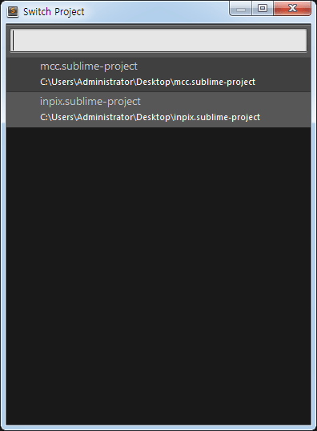

# 프로젝트 생성

## 프로젝트 만들기
1. 'Project > Add Folder to Project'
2. 'Project > Save as Project'

.sublime-project 파일의 내용은 다음과 같은 json 형식으로 관리됩니다.

```json
{
    "folders":
    [
        {
            "path": "C:\\Users\\Administrator\\work\\my_git_books\\sublime-text3"
        }
    ]
}
```

## 프로젝트 찾기
'Project > Quick Switch Project(Ctrl+Alt+P)'



다수의 프로젝트가 존재할 경우 프로젝트 검색을 통하여 프로젝트를 빠르게 오픈 할 수 있습니다.


