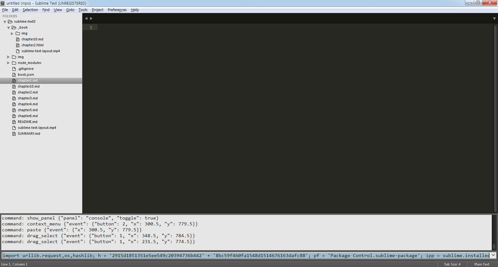
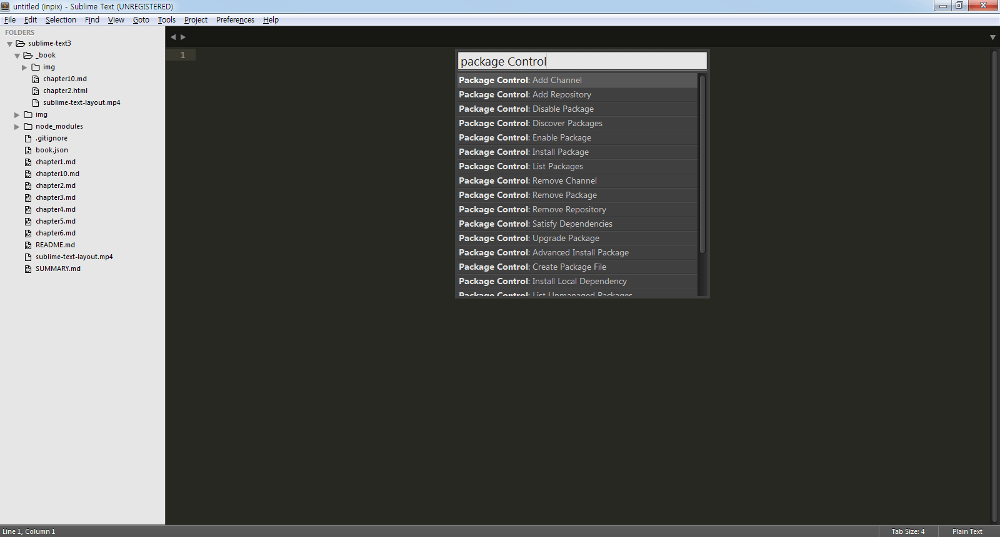

# 패키지

서브라임이 기본적으로 제공하지 않는 기능들을 확장기능을 설치해 추가 적인 기능을 사용할 수 있게 합니다.

## Sublime Package Control

Sublime Package Control을 설치해 원하는 패키지를 검색하여 바로 설치가능하게 만드는 패키지입니다.

https://packagecontrol.io/installation 에 설치 방법이 설명되어 있습니다.

## 설치

서브라임 텍스트3 기준으로 설치 설명을 진행합니다.


```
import urllib.request,os,hashlib; h = '2915d1851351e5ee549c20394736b442' + '8bc59f460fa1548d1514676163dafc88'; pf = 'Package Control.sublime-package'; ipp = sublime.installed_packages_path(); urllib.request.install_opener( urllib.request.build_opener( urllib.request.ProxyHandler()) ); by = urllib.request.urlopen( 'http://packagecontrol.io/' + pf.replace(' ', '%20')).read(); dh = hashlib.sha256(by).hexdigest(); print('Error validating download (got %s instead of %s), please try manual install' % (dh, h)) if dh != h else open(os.path.join( ipp, pf), 'wb' ).write(by)
```

1. 아래 코드를 복사합니다.
2. 메뉴의 'View > Show Console'을 선택합니다. 단축키 'Ctrl+`'
3. 열여진 콘솔에 복사된 코드를 입력한 후 'Enter'
4. Sublime Text3 프로그램을 종료 후 다시 시작합니다.



## 패키지 설치

1. 메뉴의 'Tools > Command Palette'를 선택합니다. 단축키 'Ctrl+Shift+P'
2. 열여진 패널 'Installl Package', 이나 'Package Install'등을 확장기능 설치 관련 키워드를 입력하면 관련된 명령어가 나타납니다.
3. 'Package Control: Installl Package'를 선택합니다.
4. 잠시후 확장기능을 검색하는 패널이 열리며 원하는 확장기능 이름을 작성합니다.
5. 설치를 원하는 확장기능을 선택하면 설치가 진행됩니다.

자주 사용하는 Package Control 명령은 아래와 같습니다.

명령어 | 설명
--- | ---
Install Package | 확장기능 설치
List Package    | 설치된 확장기능 보기
Remove Package  | 설치된 확장기능 삭제
Disable Package | 설확치된 장기능 사용 불가
Enable Package  | Disable 된 확장기능 사용


