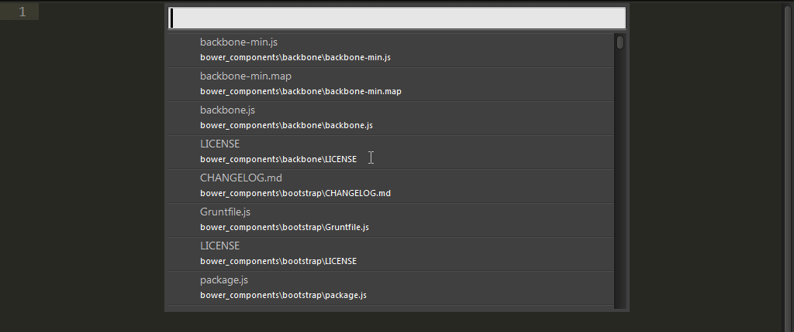
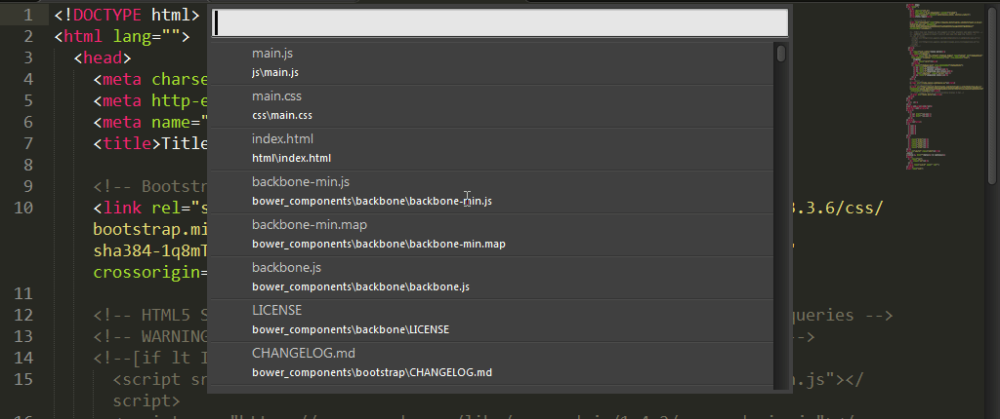
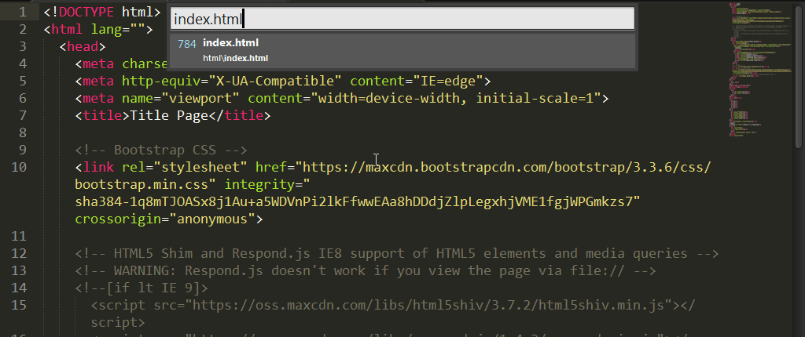
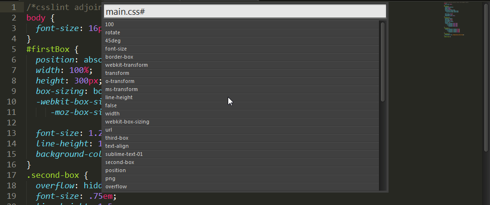
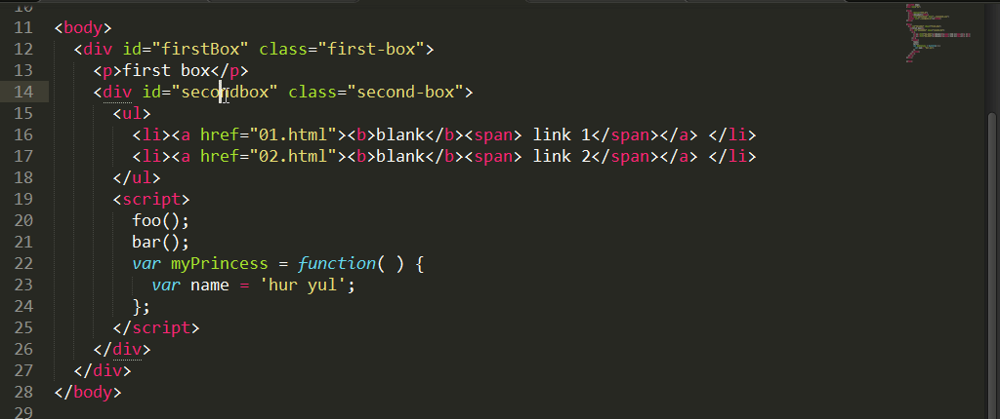

# Goto Anything

코드를 작성하다 보면 우리는 파일을 찾기 위해 하루에 과연 몇 번이나 탐색기를 열게 될까요? 아니면 편집기에서 제공하는 Side Bar의 폴더 트리를 얼마나 많이 클릭할까요? 

이런 작업이 우리의 시간을 얼마나 많이 잡아먹고 있는지, 나의 소중한 손목을 힘들게 하는지를 서브라임 텍스트의 Goto Anything을 사용하게 되면 알게 됩니다.

## 파일 찾기
메뉴의 Goto > Goto Anything을 실행하면, Panel이 열립니다. Panel에는 파일 목록과 텍스트를 입력할 수 있는 공간이 있습니다. 텍스트를 입력하는 곳에 키워드를 입력하면 파일 목록이 즉시 변경되는 것을 볼 수 있습니다.

목록에 나타난 내용은 현재 프로젝트에 포함되어 있는 파일들이며 입력된 키워드가 정확하지 않아도 비슷한 키워드가 있는 파일명을 추출해 목록에 반영합니다. 목록에서 열고자 하는 파일이 있다면 방향키로 목록에 있는 내용을 선택하시면 됩니다. 여기서 놀라운 것은 파일을 열리 않아도 화면에 선택된 목록의 파일 내용이 즉시 반영된다는 것입니다. 우리는 파일의 내용을 미리 확인할 수 있으며 선택된 목록을 클릭하거나 Enter 키를 누르면 해당 파일이 편집 가능한 상태로 열리게 됩니다.

키워드에는 파일명만 입력할 수 있는 것이 아니라 파일의 경로도 입력 가능해 원하는 파일을 정말 빠르게 찾아 미리 확인하고 열 수 있습니다. 또한 파일명과 자바스크립트 함수, CSS 선택자, HTML 아이디, 라인 번호, 키워드를 조합해 파일을 열 때 편집하고자 하는 곳으로 정확하게 이동해 빠른 편집이 가능합니다.

## 심벌 찾기
심벌은 HTML 파일의 아이디, Javascript의 함수나 메서드, 생성자 이름, CSS 파일의 선택자 등 각 언어별 특정한 키워드가 될 수 있습니다.

서브라임 텍스트는 문서 내 심벌을 빨리 찾는 기능을 제공해 주고 있습니다. Ctrl+R 키를 눌러 Goto Anything 패널을 실행하면 Ctrl+P를 눌러 실행한 것과 다르게 ‘@’(At Sign)이 입력된 상태로 패널이 열린 것을 확인할 수 있습니다.
프로젝트 전체에 있는 심벌을 검색하는 방법이 있는데 Ctrl+Shift+R 키를 사용합니다.

## 라인 찾기
Ctrl+G 키를 누리면 ‘:’(Colon)이 입력된 상태로 Goto Anything 패널을 실행됩니다. 바로 이동하고 싶은 라인 번호를 입력하면 해당 라인이 Highlight 되고 선택하면 해당 라인으로 이동합니다.

## 키워드 찾기
Ctrl+;(Semicolon) 키를 누리면 ‘#’(Hashtag)가 입력된 상태로 Goto Anything 패널을 실행됩니다. 찾으려는 키워드를 입력하면 해당하는 키워드를 포함한 단어가 패널에 나타나며 방향키를 통해 해당 목록으로 이동하면 해당 라인이 Highlight 되고 선택하면 해당 라인으로 이동합니다.

## 심벌 이동
서브라임 텍스트에는 조금 더 특별한 이동 기능이 있습니다. “Goto Definition” 이라는 기능입니다. Html 문서에서 CSS 클래스나 호출된 함수에 커스를 위치하고 F12를 누르게 되면 해당 클래스나 함수가 있는 파일이 열리며 커서의 위치 역시 HTML 문서에서 선택한 클래스나 함수로 바로 이동되어 편집 작업을 빠르게 할 수 있습니다.

열려진 파일의 클래스나 함수에서 다시 이전 파일로 돌아가려면 Alt+- 키를 누르면 됩니다. 수정중인 괄호 안에서 Alt+-키를 눌러도 이전 파일로 돌아갑니다.

### Gogo Anything 단축키
단축키 | 설명
--- | ---
파일 찾기 | Ctrl+P
심벌 찾기 | Ctrl+R
프로젝트 전체에서 심벌 찾기 | Ctrl+Shift+R
라인 찾기 | Ctrl+G
키워드 찾기 | Ctrl+:(Colon)
심벌 이동 | F12
심벌 이동 - 돌아가기 | Alt+-(Hyphen)
