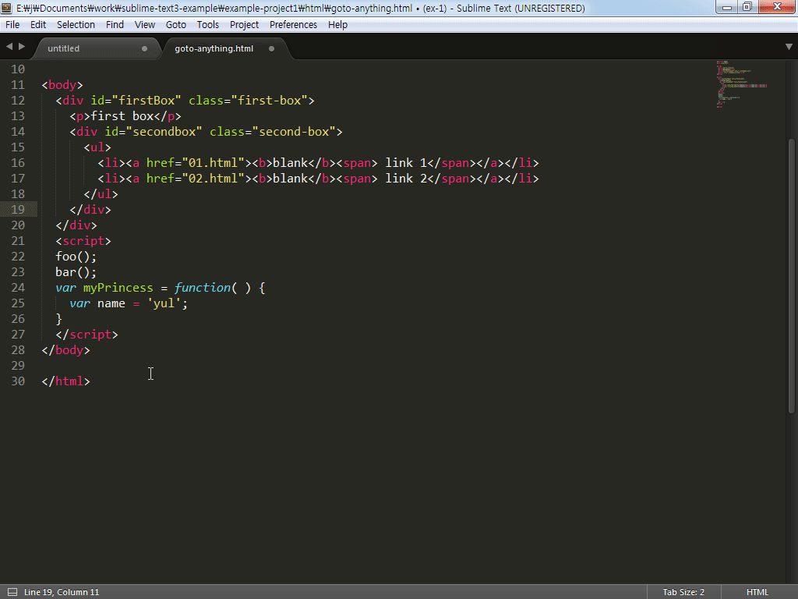

# 키 바인딩

서브라임 텍스트에 대해 소개하는 동안 몇 차례 사용자 단축키를 지정해 보았습니다. 서브라임 텍스트는 거의 모든 기능을 단축키로 제공하고 있기 때문에 작업환경에 맞게, 사용자의 편의에 맞게 단축키를 지정해 사용할 수 있습니다. 간혹 플러그인을 설치해 사용할 경우 단축키가 중복되는 현상이 있어 사용자 단축키를 설정하는 방법을 통해 이러한 문제를 해결할 수 있습니다.  사용자 단축키를 작성하기 위해서는 키 바인딩 문법을 먼저 알아야 합니다.

"Preferences > Key Bindings - Default"를 실행해 기본 키 설정이 어떻게 되어있는지 확인해 보시면 도움이 될 것입니다. 변경하려는 단축키가 있다면 검색을 통해 해당 코드를 복사해 사용자 키 바인딩 파일에 붙여 넣고 Keys 항목만 수정해 간단히 단축키를 변경할 수 있습니다.

## 키 바인딩의 구조
```javascript
[{
  "keys": ["enter"],
  "command": "insert",
  "args": { "characters": "\n" }
}, {
  "keys": ["enter"],
  "command": "find_next",
  "context": [
    { "key": "panel", "operand": "find" }, { "key": "panel_has_focus" }
  ]
}]
```

__keys__: 대소문자를 구분해서 키를 입력합니다. "[]"(Bracket) 안에 작성합니다. 단축키가 두 개 이상 있다면 ["Ctrl+K", "Ctrl+B"] 배열로 작성합니다.

__command__:  실행될 명령어를 입력합니다. 정의가 되어있는 명령어만 사용이 가능합니다.

__args__: 실행된 명령에 인수를 전달함으로 추가적인 작업을 진행할 수 있습니다

__context__: 컨텍스트의 조건이 true일 경우 실행합니다.

## 명령어 찾기

단축키를 추가하거나 수정하려면 명령어를 알아야 하고, 단축키가 미리 사용되고 있는지도 알아야 합니다. 기본 설정 파일을 검색해 확인할 수 있지만, 플러그인에서 제공하는 단축키는 검색이 되지 않을 수도 있으며, 기능에 대한 명령어를 확인하기 어려운 경우가 있습니다.



"View > Show Console - Ctrl+`(Grave)"를 실행해 서브라임 콘솔 창을 열고 "sublime.log_commands(True)를 입력합니다. 사용자의 이벤트에 따라 command가 콘솔에 출력됩니다. 출력된 명령어를 가지고 단축키를 지정해 사용하면 됩니다. 단축키를 눌렀는데 콘솔에 명령어가 나타나지 않는다면 해당 단축키는 사용하지 않는 것으로 판단할 수 있습니다. 이 단축키는 안전하게 사용할 수 있는 것입니다.

참고: Reference : http://docs.sublimetext.info/en/latest/reference/key_bindings.html
