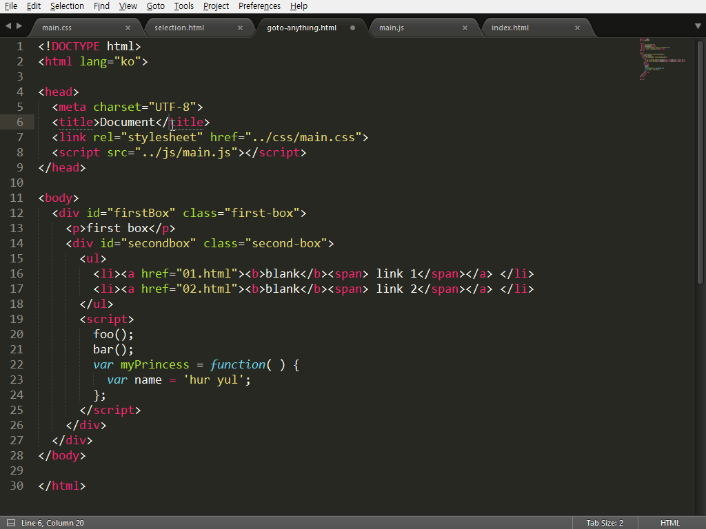
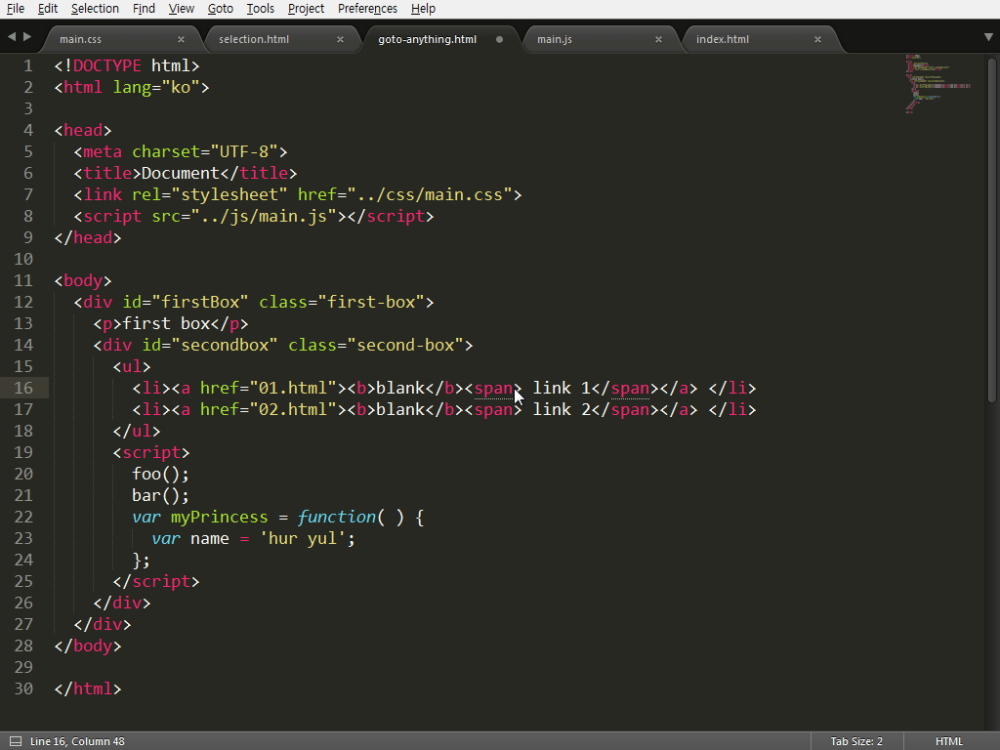
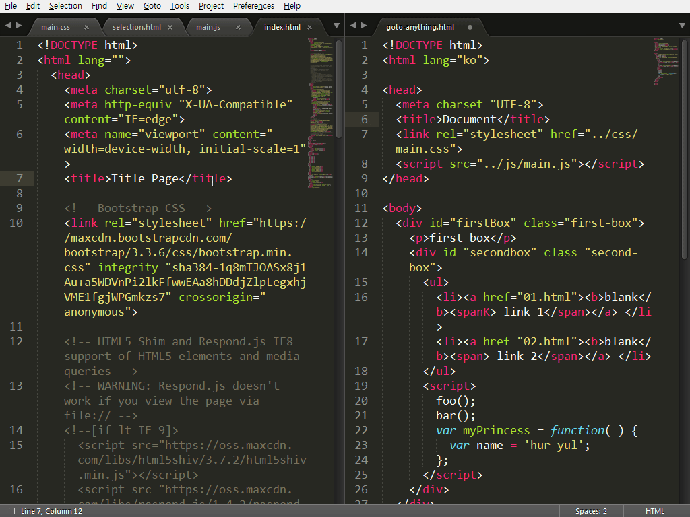
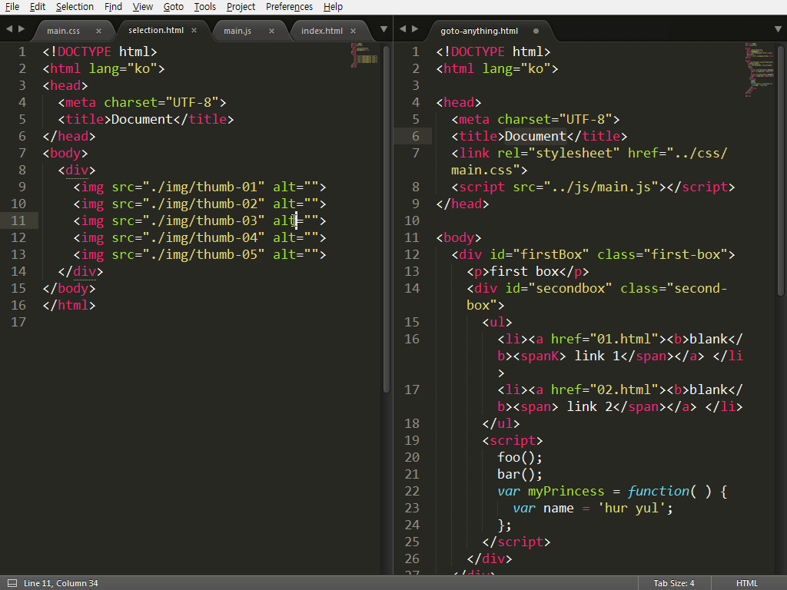

# 레이아웃과 그룹

코드를 편집하다 보면 하나의 파일만 수정하는 것이 아니라 여러 파일을 동시에 수정하게 됩니다. HTML 파일을 작업하다 보면 스타일 지정을 위해 CSS 파일을 수정해야 하며, HTML화면의 인터랙션을 만들기 위해 Javascript 파일을 수정하는 작업도 진행합니다. 이렇게 여러 파일을 이동해 가면서 수정하는 작업은 많은 마우스 조작이나 키보드 조작이 필요하게 됩니다.

파일을 이동하는 작업을 최소화하기 위해 편집기를 다중으로 실행시켜 작업하는 분도 있을 것이며, 편집기에서 제공하는 창 분할 방법을 통해 작업하는 분도 있을 것입니다.

서브라임 텍스트는 편집기를 다중으로 실행시킬 수 있으며, 창을 분할하는 기능도 지원하고 있습니다. 그럼 서브라임 텍스트의 레이아웃 기능으로 조금 더 편리하고 빠르게 창을 분할해서 코드를 편집하는 방법에 대해 설명해 드리겠습니다.

## Layout

메뉴의 “View > Layout”을 열어 보면 화면 구성할 수 있는 세부 항목이 나타납니다. 구성할 수 있는 화면은 하나의 전체 화면, 가로 2개부터 4개, 세로 2개부터 3개, 그리고 바둑판 모양으로 4개의 화면을 구성할 수 있습니다. 이렇게 분할된 화면 영역을 Group이라고 말합니다.

화면 분할 역시 단축키를 기본으로 제공하고 있으며 단축키 구성은 아래와 같습니다.

단축키|설명
---|---
Alt+Shift+1 | Single 
Alt+Shift+2 | Columns: 2 
Alt+Shift+3 | Columns: 3 
Alt+Shift+4 | Columns: 4 
Alt+Shift+8 | Rows: 2 
Alt+Shift+9 | Rows: 3 
Alt+Shift+5 | Grid: 4 

## Group
창을 분할할 때 레이아웃을 통해 그룹을 먼저 생성하고 생성된 그룹에서 파일을 열 수도 있지만 현재 편집중인 그룹에서 파일을 열었을 경우는 많은 조작이 필요하게 됩니다. 레이아웃을 통해 새로운 그룹을 만들고 다시 이전 편집 그룹으로 포커스를 이동해 이동하려는 파일을 선택해 이동을 시켜야 합니다. 

“Groups > Move File to New Group” 메뉴를 통해서 이러한 작업을 한번에 해결할 수 있습니다. 하지만 메뉴를 통해 작업을 진행하는 것 역시 많은 조작이 필요합니다. 친절한 서브라임 텍스트는 자주 사용할 것 같은 기능은 언제나 단축키를 제공하고 있습니다. Ctrl+K, Ctrl+Up 키를 사용해 편집 그룹을 바로 생성할 수 있습니다. 생성된 그룹을 삭제하려면 Ctrl+K, Ctrl+Down 키를 사용하며, 삭제된 그룹에 있던 파일을 이전 그룹으로 이동됩니다.

단축키|설명
---|---
Ctrl+K, Ctrl+Up | 새로운 그룹을 만들고 현재 편집 포커스가 있는 파일을 이동 시킨다.
Alt+Shift+Down | 생성된 그룹을 삭제한다. 삭제된 그룹에 있는 파일은 이전 그룹을 이동됨.

## Focus Group

그룹을 나누어 편집하다 보면 다른 그룹에 있는 파일을 수정해야 하는 일이 자주 발생합니다. 일반적으로 마우스를 이용해 편집하고자 하는 그룹으로 포커스를 이동해 편집 작업을 진행합니다.

서브라임 텍스트는 “Focus Group” 메뉴를 통해 그룹간 포커스 이동 기능을 제공합니다. 이 기능은 그룹간 포커스 이동시 파일의 마지막 커서 위치로 이동이 가능해 매우 유용한 기능입니다.  그러나 메뉴를 통해 포커스를 이동시키는 작업은 마우스를 사용하는 것 보다 더 불편합니다. 그렇습니다. 이야기하고자 하는 것은 단축키를 이용해 그룹간 포커스를 이동하자는 것입니다. 단축키 역시 직관적입니다. Ctrl+1은 첫 번째 그룹, Ctrl+2는 두 번째 그룹으로 이동합니다. Ctrl+number 키 조합으로 열려있는 그룹을 자유롭게 이동하면 됩니다.

이동한 그룹에 여러 파일이 열여 있다면 Ctrl+PgUp이나 Ctrl+PgDn 키를 이용해 그룹 안에서 파일을 이동할 수 있습니다.

단축키|설명
---|---
Ctrl+K, Ctrl+Right |  다음 그룹으로 포커스 이동
Ctrl+K, Ctrl+Left | 이전 그룹으로 포커스 이동
Ctrl+Number | 생성된 그룹 순서로 포커스 이동

## Move File To Group

그룹으로 나누어 작업 진행하다 보면 파일의 이동도 필요합니다. 항상 원하는 그룹으로 파일을 직접 열어 편집을 진행할 수도 있지만 작업을 진행하다 보면 다른 그룹에서 파일을 여는 경우가 종종 발생하곤 합니다. 이러한 경우 이동하려는 파일의 탭을 선택해 다른 그룹으로 드래그해 파일을 옮길 수 있으며, 단축키로 이동도 가능합니다. 드래그 기능을 통해 파일을 다른 그룹으로 이동시킬 때 탭 영역으로 정확하게 이동시키지 않으면 새 창으로 파일이 열리게 됩니다.

키보드로 파일을 이동시키는 단축키는 두 가지가 있으며 키보드 사용이 편한 방법을 사용하면 되겠습니다. 이동되는 파일은 현재 포커스가 있는 파일입니다. 

단축키|설명
---|---
Ctrl+K, Ctrl+Shift+Right |  다음 그룹으로 파일 이동
Ctrl+K, Ctrl+Shift+Left | 이전 그룹으로 파일 이동
Ctrl+Alt+Number | 생성된 그룹 순서로 파일 이동

