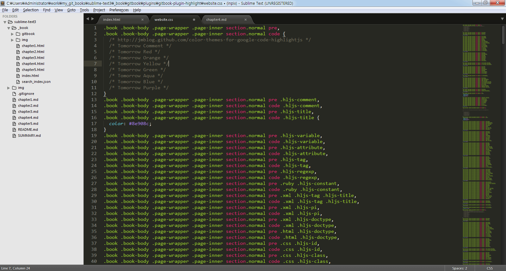

# 레이아웃

화면 분활, 분활된 화면으로 포커스 이동, 분활된 화면으로 파일 이동을 단축키를 통하여 빠르게 지정하여 사용할 수 있다.

## Layout
하면을 분할하는기능으로 가로, 세로, 그리드 형태로 쉽게 전환할 수 있습니다.

설명|단축키
---|---
Single | Alt+Shift+1
Columns: 2 | Alt+Shift+2
Columns: 3 | Alt+Shift+3
Columns: 4 | Alt+Shift+4
Rows: 2 | Alt+Shift+8
Rows: 3 | Alt+Shift+9
Grid: 4 | Alt+Shift+5

## Focus Group
분활된 화면 하나를 그룹이라고 하며, 마우스 컨트롤 없이 단축키만으로 분활된 화면 중 하나로 포커스를 이동할 수 있습니다.

설명|단축키
---|---
Group: 1 | Ctrl+1
Group: 2 | Ctrl+2

## Move File To Group
현재 포커싱된 파일을 다른 그룹으로 이동시켜 주는 기능입니다.

설명|단축키
---|---
Group: 1 | Ctrl+Shift+1
Group: 2 | Ctrl+Shift+2

