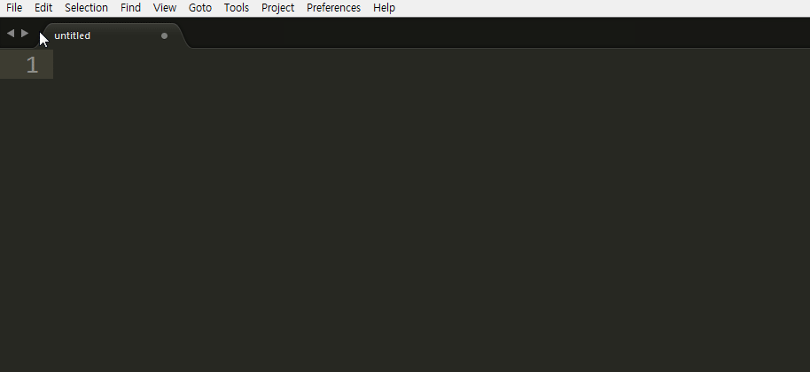
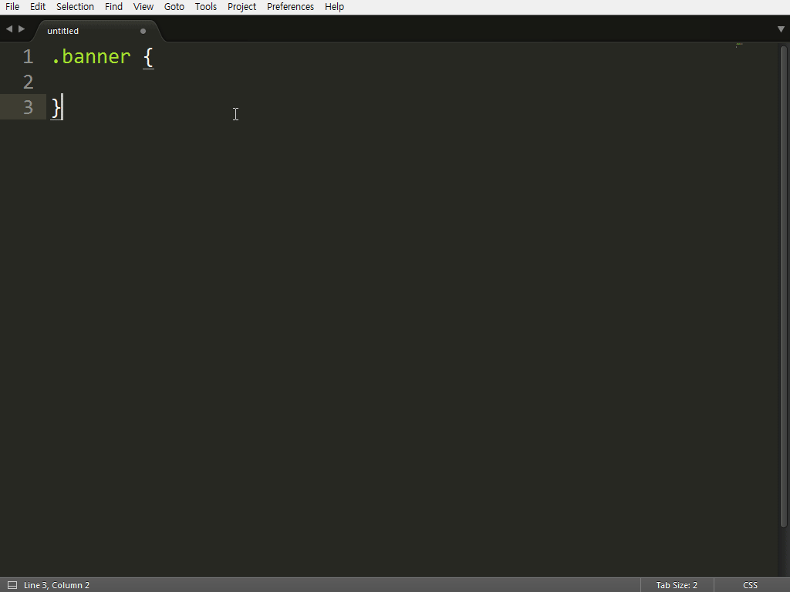
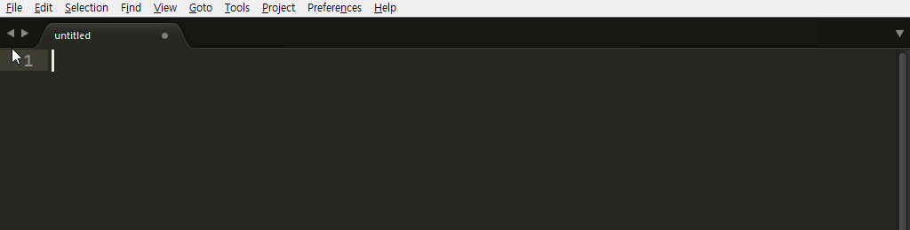
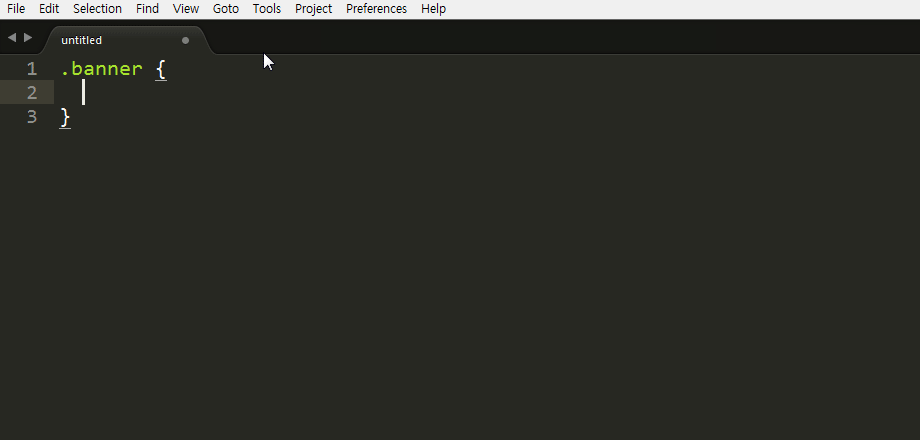
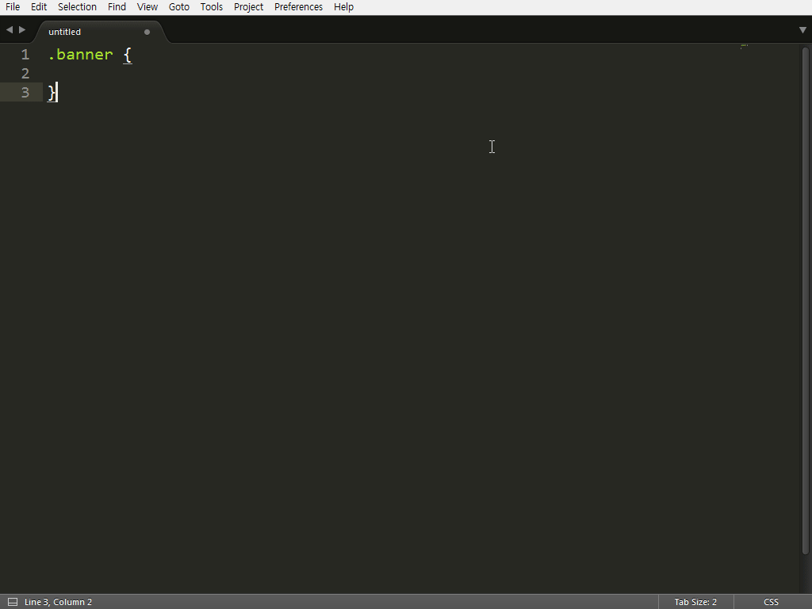
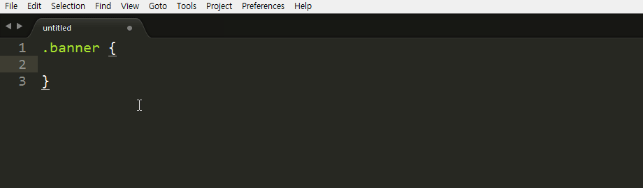

# 매크로

매크로는 편집하는 과정을 저장해 나중에 동일한 작업을 진행 때 저장된 기록을 실행해 반복되는 작업을 줄여 편집 시간을 단축시켜 주는 기능입니다.

매크로를 사용하는 방법은 "Tools > Record Macro" 선택하고 "Tools > Stop Recording Macro"를 선택하기 전까지 사용자의 행동이 기록됩니다. "Tools > Palyback Macro"를 선택하면 기록된 사용자의 행동이 실행됩니다.

그럼 어떤 기능을 녹화해 활용하면 좋을까요? 저는 Brace를 자동으로 만들고 새로운 라인을 추가해 바로 코드가 입력되는 기능을 만들어 보겠습니다.

```css
.banner {}
```

CSS 파일을 열어 '.banner'를 입력하고 공백을 한 칸 입력한 다음 '{'(Left Brace)를 입력하면 서브라임 텍스트는 자동으로 '}'(Right Brace)가 입력됩니다. 속성을 한 줄에 입력하는 코딩 스타일을 가졌다면 편리하겠지만 유지 보수와 가독성을 위해 속성 하나당 한 줄씩 입력하는 방법을 사용할 것입니다. 그렇다면 속성을 입력하기 위해서는 다시 'Enter'키를 눌러야 합니다. CSS 속성을 작성하기 위해 선택자를 타이핑하는 것을 제외하고 공백, 중괄호, 엔터 이렇게 3번의 동작이 필요합니다.

```css
.banner {
  
}
```

## 예제 - 1
### 매크로 녹화 및 실행
CSS 파일을 열어 .banner를 입력하고 "Ctrl+Q"를 실행해 녹화를 시작합니다. 이후부터 사용자가 실행하는 작업은 매크로에 녹화됩니다. 공백을 한칸 입력하고 '{'(Left Brace)를 입력하면 '}'(Right Brace)가 자동으로 입력되며 커서는 Brace 안으로 이동됩니다. Enter를 입력해 줄 바꿈을 한 후, 다시 "Ctrl+Q"를 입력해 녹화를 종료합니다.

이제 새로운 CSS 클래스 명을 작성한 후 "Tools > Palyback Macro"를 선택하면 조금전 녹화한 작업이 실행됩니다.



### 매크로 저장

이 세 번의 작업을 매크로로 녹화하고 실행하면 잘 동작합니다. 하지만 다른 기능을 녹화하거나, 프로그램을 종료하면 저장된 매크로는 삭제됩니다.

현재 기록한 매크로를 이후에도 사용하려면 "Tools > Save Macro"를 선택해 저장하면 됩니다. 매크로 파일의 저장 위치는 서브라임 텍스트 설치경로인 "Packages > User" 폴더에 저장하거나, 하위에 새로운 폴더를 만들어 저장하면 됩니다. 파일 관리를 위해 새로운 폴더를 만들어 저장하는 것을 권장합니다. "new-curly(컬리)-line" 이름으로 저장합니다. "Tools > Macros > User > Macro > new-curly-line" 을 선택해 저장한 동작을 실행할 수 있습니다.



### 환경설정 - 사용자 키 등록

메뉴를 통해 사용자가 저장한 매크로를 실행하는 것은 오히려 더 손이 많이 가는 작업이 될 수 있습니다. 사용자가 저장한 매크로를 단축키로 저장해 실행하는 방법을 알아보겠습니다.

"Preferences > Key Bindings > User" 실행해 사용자 키 설정 파일을 열어 아래 내용을 작성합니다. 

```javascript
[{
  "keys": ["alt+enter"],
  "command": "run_macro_file",
  "args": {
    "file": "Packages/User/macro/new-curly-line.sublime-macro"
  }
}]
```

'.banner'를 입력한 후 alt+enter 키를 실행하면 매크로에 저장한 기능이 실행되는 됩니다.



## 예제 - 2

CSS 파일을 수정하다 보면 어떤 선택자에 속성을 추가하고, 수정한 선택자 뒤에 다른 선택자를 새로 작성해야 하는 상황이 있을 수 있습니다. 또는 스크립트를 작성할 때 Brace 영역 안에 내용을 작성하고 닫는 Brace 뒤로 포인터를 이동해 세미콜론을 작성해야 하는 코드가 있을 수 있습니다. 이런 일련의 작업을 진행하기 위해서는 많은 조작이 필요하지만 "Shift+Enter" 키를 실행해 닫는 Brace 뒤로 포인터를 이동해 빠르게 편집을 할 수 있는 기능을 만들어 보도록 하겠습니다.



Ctrl+Q를 눌러 매크로 기능을 실행한 후 Brace 영역 안에서 Ctrl+Shift+M을 눌러 Brace 영역을 선택합니다. 영역을 선택하면 포인터의 위치는 닫는 Brace 앞에 위치하게 되는데 End 키를 눌러 Brace 뒤로 커서를 이동시킵니다. 다시 Ctrl+Q를 눌러 매크로 기능을 중지하고 "Tools > Save Macro"를 실행해 사용자 폴더에 "move-to-brackets-eol"로 파일을 저장합니다. 메뉴에 새로 만든 매크로가 있는지 확인한 후 실행해 보고 잘 동작한다면 단축키를 등록합니다.



"Preferences > Key Bindings- User" 파일을 열고 아래 내용을 작성합니다.

```javascript
[{
  "keys": ["shift+enter"],
  "command": "run_macro_file",
  "args": {
    "file": "Packages/User/macro/move-to-brackets-eol.sublime-macro"
  }
}]
```



