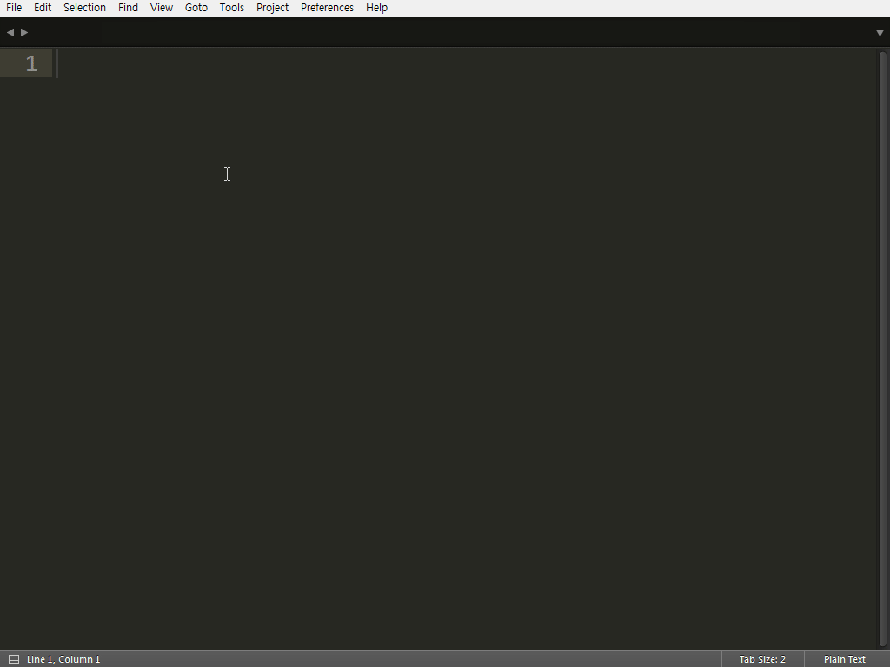
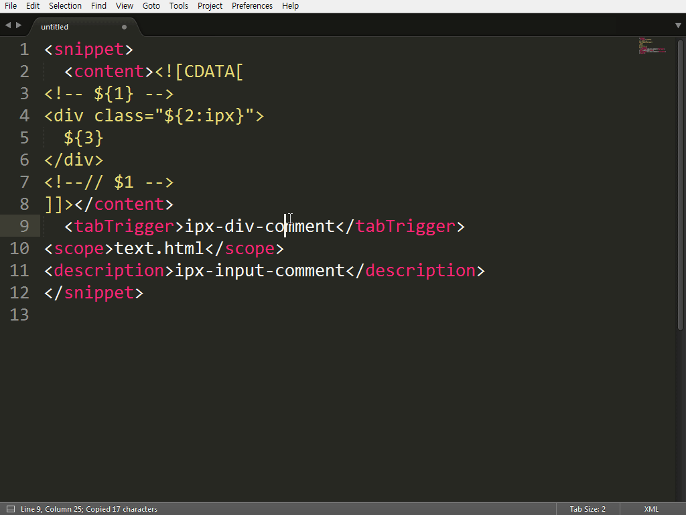
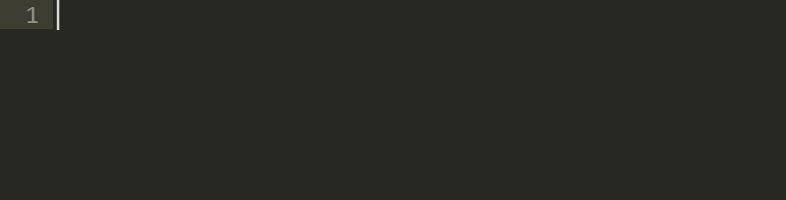

# New Snippets

서브라임 텍스트에는 New Snippets이라는 사용자 코드를 추가할 수 있는 기능이 있습니다. 추가한 사용자 코드는 사용자가 지정한 키워드와 함께 Tab 키를 입력하면 추가한 사용자 코드가 파일에 자동완성되는 유용한 기능입니다. 

## 예제 - 1



### 작성
그럼 직접 snippets을 새로 작성해 보겠습니다. 메뉴의 “Tool > New Snippets”를 선택합니다.

Sinppets을 작성하기 위한 기본 코드의 구조가 새 파일로 열립니다.

```html
<snippet>
  <content><![CDATA[
Hello, ${1:this} is a ${2:snippet}.
]]></content>
  <!-- Optional: Set a tabTrigger to define how to trigger the snippet -->
  <!-- <tabTrigger>hello</tabTrigger> -->
  <!-- Optional: Set a scope to limit where the snippet will trigger -->
  <!-- <scope>source.python</scope> -->
</snippet>
```

예제로 사용자 input 태그를 만들어 보겠습니다. 코드의 작성은 “CDATA” 태그 안에 작성합니다.

```html
<snippet>
  <content><![CDATA[
<input type="text" class="${1:ipx}"${2}>
]]></content>
  <tabTrigger>ipx-input:text</tabTrigger>
<scope>text.html</scope>
<description>ipx-input-text</description>
</snippet>

```

### 저장
작성을 하였으면 파일을 저장합니다. 저장하는 파일의 위치는 서브라임 텍스트가 설치된 경로의 “Packages > User” 폴더 안에 저장하면 됩니다. User 폴더 안에 새로운 폴더를 만들어 저장해도 상관없습니다. 파일의 관리적인 측면을 고려해서 새로운 폴더를 만들어 저장하는 것이 좋을 것 같습니다.

서브라임 텍스트의 Packages 폴더를 확인하는 간단한 방법은 “Preferences > Browse Packages” 메뉴를 선택하면 탐색 창으로 Packages 폴더 열여 위치를 확인할 수 있습니다. 

파일 저장을 ipx-input:text로 저장을 하겠습니다. 'ipx'는 접두어로 사용하며 '-'(Hyphen)은 단어 구분자로 사용하고 ':'(Colon)은 input 태그의 type을 지정한 것입니다. Snippets의 이름을 지정할 때 쉽게 찾을 수 있는 키워드를 사용하는 것이 효율 적일 것입니다.

### 실행

이제 편집기로 돌아와 예제를 실행해 봅니다.

tabTrigger 안에 있는 텍스트를 입력하고 탭을 누르면 CDATA 안의 새로 작성한 코드가 편집 창에 출력됩니다. Scope의 “text.html”은 html 파일의 Snippets을 지정한 것입니다. 자바스크립트는 'source.js', CSS 파일은 'source.css'로 저장하면 됩니다. 

${number}는 코드가 출력되고 탭을 누르면 해당하는 곳으로 포커스가 순차적으로 이동해 다음 수정을 바로 진행할 수 있는 유용한 기능을 제공하고 있습니다. ${1:ipx}은 탭을 누르면 ipx라는 텍스트가 선택된 상태로 이동해 해당 텍스트를 다른 텍스트로 바로 수정할 수 있게 됩니다. 예제에서 ${2}는 input의 title, id, name 등 다른 어트리뷰트를 작성할 경우가 많이 있어, 다음 이동을 닫는 태그 바로 앞으로 이동시킨 것입니다.


## 예제 - 2




예제를 하나 더 작성해보도록 하겠습니다. 다시 “Tool > New Snippets”를 실행해 Snippets 템플릿 파일을 열어 다음과 같은 코드를 작성합니다.

```html
<snippet>
  <content><![CDATA[
<!-- ${1} -->
<div class="${2:ipx}">
  ${3}
</div>
<!--// $1 -->
]]></content>
  <tabTrigger>ipx-div-comment</tabTrigger>
<scope>text.html</scope>
<description>ipx-input- comment</description>
</snippet>
```

이 예제는 'ipx-div-comment'로 파일을 저장하고 실행을 해 보겠습니다. tabTrigger에 작성한 텍스트를 입력하고 탭을 누르면 시작 주석에 내용을 작성할 수 있는데 작성한 주석은 닫는 주석에 같이 입력됩니다. 다시 탭을 누르면 class 어트리뷰트를 작성할 수 있으며, 다시 탭을 누르면 div 태그 영역 안으로 이동해 코드를 입력할 수 있는 구조입니다. 

Div 태그에 많은 내용이 들어가 한 눈으로 코드의 내용을 파악하기 어려운 경우 주석으로 어떤 내용을 제공하고 있는지 코멘트를 작성할 수 있는 예제를 만들어 보았습니다. 코드의 가독성에 도움을 줄 수 있는 좋은 예제입니다.

## 환경설정 - 자동완성 목록 추가



Snippets 파일이 많아지면 일일이 tabTrigger 이름을 기억하는 것이 쉽지 않을 것입니다. 메뉴의 "Tools > Snippets"을 실행해보면 작성되어 있는 tabTrigger 이름 목록이 나타나지만 이런 접근 방식으로 Snippets을 사용하는 것은 조금 불편할 것 같습니다.

자동완성 목록에 사용자가 추가한 Sinppets을 등록해 더욱 편리하게 Snippets을 사용할 수 있습니다. "Preferences > Settings - User" 파일을 열어 다음 코드를 입력합니다.

```javascript
{
  "auto_complete_triggers": [{
    "characters": ">",
    "selector": "text.html"
  }, {
    "characters": "ipx",
    "selector": "text.html"
  }],
}
```


