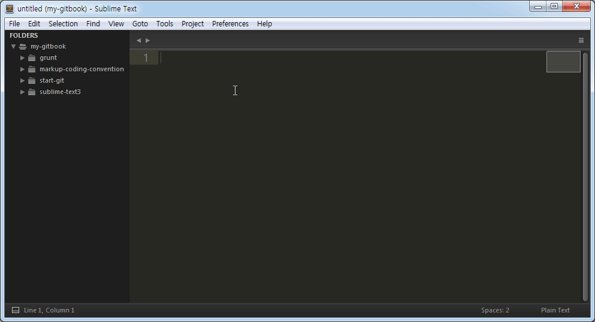

# AdvancedNewFile
서브라임 텍스트의 파일 생성 방법은 "File > New File"이나 Ctrl+N 실행해 새로운 파일을 생성하고 저장할 때 파일명을 작성하는 것입니다. AdvancedNewFile 플러그인을 설치해 파일 및 폴더를 쉽게 생성할 수 있습니다.

## 설치
Command Palette를 열고(Ctrl+Shift+P) "Package Install" 입력해 Package Control를 실행합니다. AdvancedNewFile을 입력해 플러그인을 설치합니다. 설치가 완료되었다면  "Preferences > Package Settings"에 플러그인 항목이 생성되어 있을 것입니다.

## 실행
파일 생성 패널을 열고(Ctrl+Alt+N) 생성하려는 파일 명을 입력하고 Enter를 누르면 파일이 생성됩니다. 신규 폴더 명과 함께 파일 명을 입력하면 폴더 및 파일이 생성되며, 탭 키를 누르면 현재 위치 기준으로 하위 폴더 명이 알파벳 순으로 하나씩 출력되며, 생성되어 있는 폴더명의 머리 글자나 머리글자 부터 일부를 입력한 후 탭키를 누르게 되면 폴더명이 자동입력 됩니다. '/'를 입력해 다시 탭을 누르면 하위 폴더 명이 나타나며 하위 폴더가 없다면 아무런 작업이 일어나지 않습니다.

Ctrl+Alt+N 단축키의 조작이 불편하다면 Command Palette를 실행해(Ctrl+Shift+P) "new file"을 입력해 "ANF: New File" AdvancedNewFile 패널을 실행할 수도 있습니다. Command Palette에서 "ANF"를 입력하면 AdvancedNewFile 의 명령을 확인할 수 있습니다.

### AdvancedNewFile 명령어
명령 | 설명
---|---
New File |  파일 생성
Delete File | 파일 삭제
Rename file | 파일 이름변경
Copy Current File | 현재 파일 복사
Delete Current File | 현재 파일 삭제

