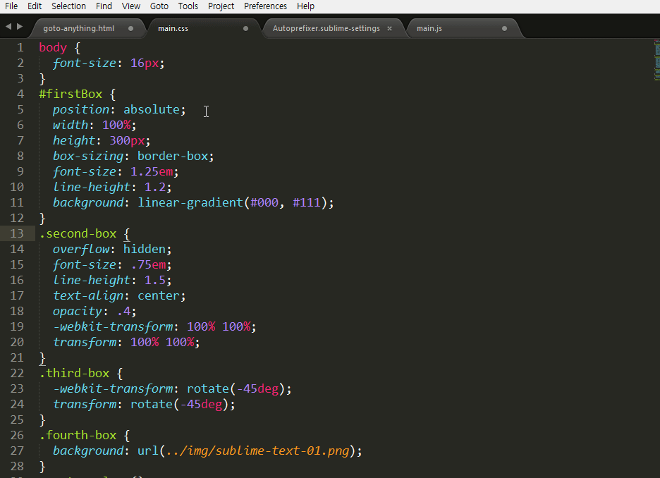

# Autoprefixer

AutoPrefixer 플러그인은 CSS 구문을 분석해 vendor-prefixed CSS 속성을 자동으로 추가해 줍니다. 이 플러그인을 실행하기 위해서는 [Node.js](https://nodejs.org/en/#download)가 설치되어 있어야 합니다.



## 설치
"Command Palette - Ctrl+Shift+P"를 실행해 "Package Control"를 열어 "install package"를 선택하고 " Autoprefixer"를 입력해 설치를 진행합니다.


설치가 완료되면 "Preferences > Package Settings > Autoprefixer " 항목이 추가된 것을 확인할 수 있습니다.

## 설정
Autoprefixer를 실행하려면 Command Palette를 열고 Autoprefix CSS 입력해 실행하면 됩니다. 기본적 벤더 프리픽스 지원 버전은 각 브라우저의 마지막 2 버전이므로, "Preferences > Package Settings > Autoprefixer > Settings - Use"에 프로젝트에서 지원하기로 협의된 브라우저를 설정하면 됩니다. 

```javascript
{
  "browsers": [
    "Android 2.3",
    "Android >= 4",
    "Chrome >= 20",
    "Firefox >= 24",
    "Explorer >= 8",
    "iOS >= 6",
    "Opera >= 12",
    "Safari >= 6"
  ]
}
```

브라우저 설정에 대한 내용은 https://github.com/ai/browserslist 에서 확인 가능합니다.

## 사용자 키 바인딩
Autoprefixer 명령은 단축키를 제공하지 않으므로 사용하기에 다소 불편하니 키 보드 단축키를 등록해 보겠습니다. Ctrl+Alt+P 키를 지정해 사용해 보겠습니다. 사용자 키를 지정하려면 두 가지 점을 확인해야 합니다. 첫 번째로는 실행하려는 명령어를 알아야 하고, 두 번째로 지정하려는 단축키가 현재 사용 중인 단축키인지 확인해 보는 것입니다.

서브라임 콘솔을 열고 sublime.log_commands(True)를 입력해 명령어 사용을 알아볼 수 있습니다. Command Palette 열고 Autoprefix CSS를 실행하면, 콘솔에 "autoprefixer"라고 출력이 됩니다. 명령어를 확인했으니 단축키를 확인해 봅니다. Ctrl+Alt+P를 입력하고 다른 명령이 출력되는지 확인합니다. 다른 명령이 출력되지 않는다면, 이 키를 등록하면 됩니다.

"Preferences > Key Bindings - User" 메뉴를 실행해 다음과 같이 작성합니다.

```javascript
[{
  "keys": ["ctrl+alt+p"],
  "command": "autoprefixer"
}]
```


### 참고자료
* GIT: https://github.com/sindresorhus/sublime-autoprefixer
* browserslist: https://github.com/ai/browserslist
* node.js: https://nodejs.org/en/#download
