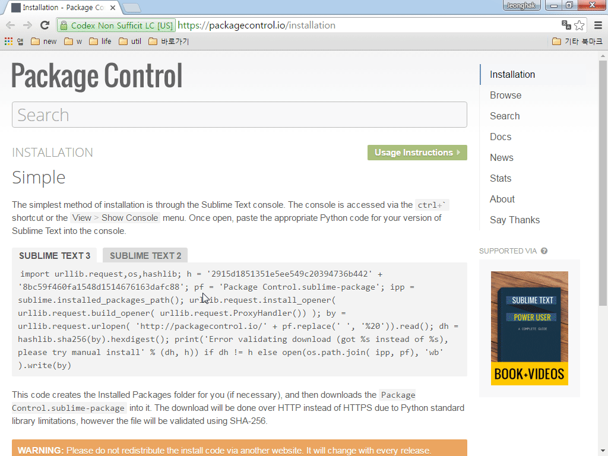
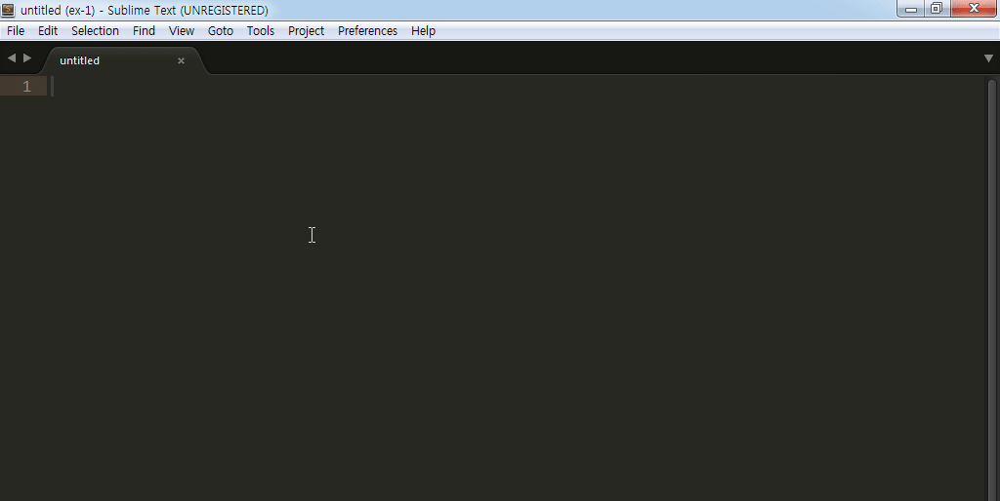

# 패키지 컨트롤

패키지란 서브라임 텍스트가 기본적으로 제공하는 기능 외, 서브라임 텍스트 개발자 및 사용자가 만들어 놓은 부가적인 기능을 말합니다. 이렇게 만들어 놓은 기능을 우리는 간단한 몇 번의 동작으로 서브라임 텍스트에 추가해 사용할 수 있습니다.

Front-End 개발에서 주로 사용하는 문법 검사, 코드 기본 포맷에 맞추어 정렬하는 기능 등 수많은 패키지가 개발되어 배포되고 있습니다. 그 밖에 편집기의 테마 및 코드의 하이라이트 기능 및 편집기를 아름답게 꾸며 사용할 수 있는 패키지 역시 손쉽게 설치해 사용할 수 있습니다.

패키지 검색은 https://packagecontrol.io/ 에 접속해 확인할 수 있으며 서브라임 텍스트의 패키지 컨트롤을 통해서도 바로 검색해서 설치할 수 있습니다. 패키지 컨트롤은 서브라임 텍스트에서 기본적으로 제공하는 기능이 아니라 패키지 설치를 통해 사용할 수 있는 기능이므로 패키지 컨트롤을 설치하는 방법부터 살펴보겠습니다.

패키지 컨트롤을 설치하는 가장 간단한 방법은 서브라임 텍스트의 콘솔을 통한 설치입니다. 'Ctrl+`(Grave) 키를 실행하거나 "View > Show Console" 메뉴를 클릭해 콘솔을 실행합니다. 패키지 컨트롤(https://packagecontrol.io/installation) 웹사이트에 접속해 파이선 코드를 복사합니다.


```python 
import urllib.request,os,hashlib; h = '2915d1851351e5ee549c20394736b442' + '8bc59f460fa1548d1514676163dafc88'; pf = 'Package Control.sublime-package'; ipp = sublime.installed_packages_path(); urllib.request.install_opener( urllib.request.build_opener( urllib.request.ProxyHandler()) ); by = urllib.request.urlopen( 'http://packagecontrol.io/' + pf.replace(' ', '%20')).read(); dh = hashlib.sha256(by).hexdigest(); print('Error validating download (got %s instead of %s), please try manual install' % (dh, h)) if dh != h else open(os.path.join( ipp, pf), 'wb' ).write(by)
```

콘솔에 복사한 코드를 붙여 넣고, 서브라임 텍스트를 다시 시작합니다.



Ctrl+Shift+P 키를 눌러 Command Palette를 열어 "Package Control"을 입력해보면 패키지 컨트롤 관련 항목이 나타납니다. 자주 사용하는 패키지 컨트롤 항목은 다음과 같습니다.

명령어 | 설명
--- | ---
Install Package | 확장기능 설치
List Package    | 설치된 확장기능 보기
Remove Package  | 설치된 확장기능 삭제
Disable Package | 설확치된 장기능 사용 불가
Enable Package  | Disable 된 확장기능 사용



### 참고자료
* 인기있는 패키지: https://packagecontrol.io/browse/popular
* 패키지 컨트롤 설치: https://packagecontrol.io/installation
