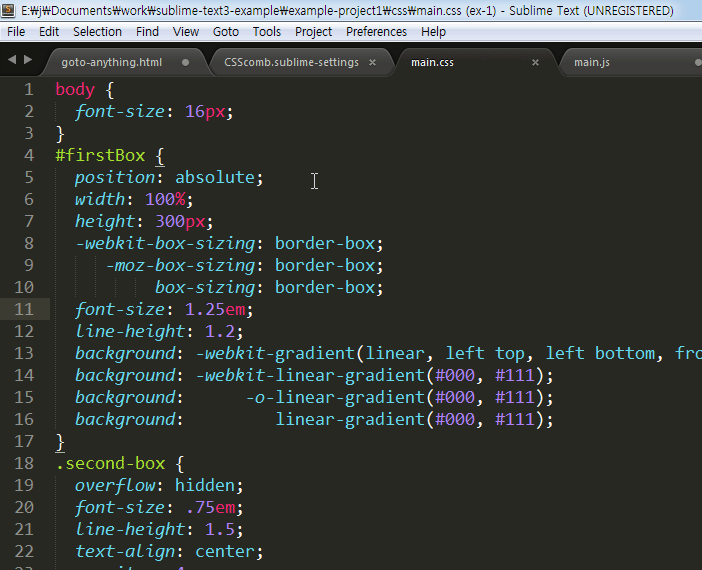

# CSScomb

CSScomb 플러그인은 CSS 코딩 스타일 포맷을 자동으로 정리해 주는 기능입니다. 앞서 소개해 드린 HTML/CSS/JS Prettify 플러그인도 같은 기능을 제공하지만, CSScomb는 여러분의 CSS 파일을 더욱 아름답게 만들어 줍니다. 대표적인 기능은 CSS 속성을 자동으로 정렬해 주는 것입니다.

## 설치
CSScomb 플러그인을 실행하기 위해서는 [Node.js](https://nodejs.org/en/#download)가 설치돼있어야 합니다. "Command Palette - Ctrl+Shift+P"를 실행해 "Package Control"를 열어 "install package"를 선택하고 " CSScomb"를 입력해 설치를 진행합니다. 

설치가 완료되면 "Preferences > Package Settings > CSScomb" 항목이 추가된 것을 확인할 수 있습니다.

## 설정
CSS 파일을 열고 Ctrl+Shift+C 키를 눌러 CSScomb를 실행할 수 있습니다. 기본 속성 값에 따라 CSS 포맷 및 속성이 정렬되지만, 여러분이 원하는 스타일로 코드가 정리되지 않았을 수 있습니다.  "Preferences > Package Settings > CSScomb > Settings User" 파일 열어 사용자 설정을 수정하거나, 사용자 설정 파일  .csscomb.json을 프로젝트 루트나 사용자 홈 디렉토리에 올려 놓아도 됩니다.

속성에 대한 내용은 [CSScomb Options](https://github.com/csscomb/csscomb.js/blob/master/doc/options.md) 웹사이트에 자세히 설명되어 있으니 꼭 확인해 보시기 바랍니다.

### 참고자료
* GIT: https://github.com/csscomb/sublime-csscomb
* node.js: https://nodejs.org/en/#download
* CSScomb Options: https://github.com/csscomb/csscomb.js/blob/master/doc/options.md
* csscomb.json: https://github.com/csscomb/csscomb.js/blob/master/config/csscomb.json
* Settings User example: https://github.com/jeonghakhur/sublime-text3/blob/master/.csscombrc 
