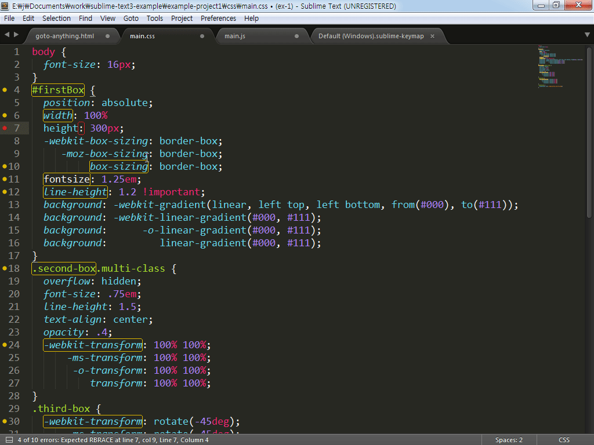
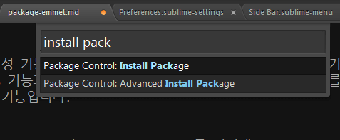

# SublimeLinter-csslint

[CSSLint](https://github.com/CSSLint/csslint/)는 CSS의 오류 사항을 검사해 주는 도구입니다. 기본적인 문법 및 문제가 있는 패턴, 비 효율적인 부분을 찾아 코드의 일련의 규칙을 검사하는 작업을 수행합니다. SublimeLinter-csslint는 서브라임 텍스트에 CSSLint 기능을 쉽게 작동할 수 있게 도움을 주는 플러그인입니다.




## CSSLint 설치

CSSLint를 실행하기 위해서는 [Node.js](https://nodejs.org/en/#download)가 설치되어야 있어야 합니다. [npm](https://www.npmjs.com/) 명령으로 csslint를 설치합니다.

```
npm install -g csslint
```

## 플러그인 설치

"Command Palette - Ctrl+Shift+P"를 실행해 "Package Control"를 열어 "install package"를 선택하고 "SublimeLinter-csslint"를 입력해 설치를 진행합니다.



## 기본 설정

ID 선택자를 사용하거나 속성이 없는 선택자가 있다면, 라인 표시줄에 경고 표시가 나타나고 상태 표시줄에 경고 메시지가 출력됩니다. csslint의 기본 규칙을 모두 충족해 작업할 수 없으므로 사용자가 기본 설정을 변경해서 사용합니다.

"Preferences > Package Settings > SublimeLinter > Settings - User" 메뉴를 실행해 사용자 설정 파일을 열어 "csslint" 항목의 규칙을 작성합니다.
* __errors__: 오류로 나타내고 싶은 규칙을 쉼표로 구분해 작성합니다.
* __warnings__: 경고로 나타내고 싶은 규칙을 쉼표로 구분해 작성합니다. 
* __ignore__: 제외하고 싶은 규칙을 쉼표로 구분해 작성합니다.


### 참고자료
* SublimeLinter-csslint: https://github.com/SublimeLinter/SublimeLinter-csslint
* CSSLint: https://github.com/CSSLint/csslint/
* CSSLint Rules: https://github.com/CSSLint/csslint/wiki/Rules
* node.js: https://nodejs.org/en/#download
* npm: https://www.npmjs.com/
* Settings - User: https://github.com/jeonghakhur/sublime-text3/blob/master/.csslintrc
