# Emmet

git: https://github.com/sergeche/emmet-sublime

Emmet은 HTML, CSS의 자동완성 기능을 통해 작업 생산성을 향상시키는 텍스트 편집기 플러그인입니다. 서브라임 텍스트의 Snippets 기능과 같이 미리 정의되어있는 문법을 입력 후 탭 키를 실행하면 정의되어 있는 코드가 자동완성 되는 기능입니다.

## 설치
Command Palette를 실행해(Ctrl+Shift+P) "install package"를 입력해 Package Control을 실행합니다. "Emmet"를 입력해 플러그인을 설치합니다.

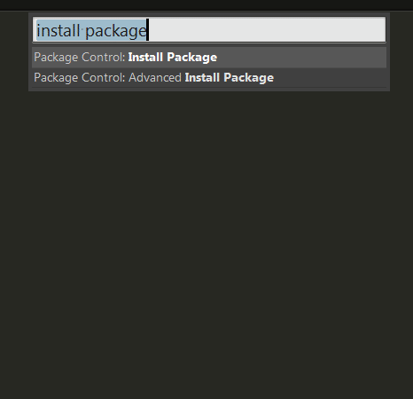

## Syntax

HTML에서 Emmet을 사용하는 기본적인 방법은 CSS3 선택자를 사용하는 것과 같은 문법을 사용하는 것입니다. 
"nav>ul>li"를 입력하고 탭을 누르면 ul 태그의 자식 태그로 ul 태그를 생성하고 ul 태그 밑에 li 태그를 자식 태그로 생성합니다.

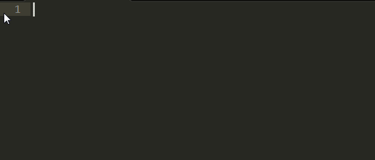

Emmet의 문법은 다음과 같습니다. 예제의 결과는 별도로 표기하지 않았으니 직접 실행해 보세요.

문법 | 예제 | 설명
---|---|---
\> | ul>li | Child
+ | p+bq |  Sibling
^ | p>span+em^bq |  Climb-up
() |  (header>ul>li*2>a)+footer | Grouping
* | ul>li*5 | Multiplication
$ | ul>li.item$*5 | numbering
\#, . |  form#search.wide |  ID and CLASS attributes
[] |  td[rowspan=2 colspan=3 title] | Custom attributes
{} |  p>{Click }+a{here}+{ to continue} | Text
   |table>.row>.col | Implicit tag names(암시적 태그 사용)

위 문법은 태그를 복합적으로 생성하는 방법며 Snippets을 사용하는 것 처럼 축약어를 입력해 자동 완성기능을 이용할 수 있습니다.

문법 | 출력
---|---
input | \<input type="text"\>
inp | \<input type="text" name="\|" id="\|"\>
input:search |  \<input type="search" name="\|" id="\|"\>

위 표는 input 태그에 관련해 예를 들은 것입니다. '|'(Vertical Bar)로 되어 있는 부분은 코드가 출력된 후 탭 키가 눌러졌을 때 커서가 이동하는 위치로 어트리뷰트 속성을 바로 수정할 수 있습니다. CSS 파일 역시 HTML과 같은 형식으로 Emmet을 사용할 수 있으며 Emmet에서 제공하는 문법은 Cheat Sheet(http://docs.emmet.io/cheat-sheet/)를 통해 확인할 수 있습니다.

## 사용방법

### 축약어 확장
__Expand Abbreviation - Ctrl+E__

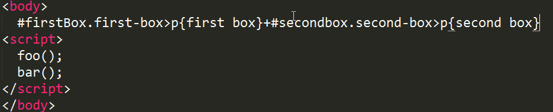

### 축약어로 감싸는 태그 생성

__Wrap With Abbreviation - Shift+Ctrl+G__

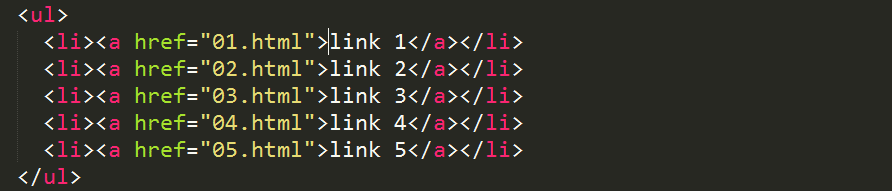
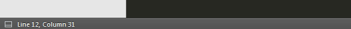

### 쌍을 이루는 태그 선택

__Match Tag Pair - SCtrl+, Shift+Ctrl+0__

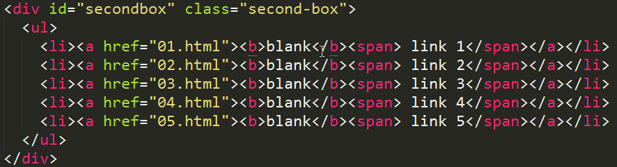

### 쌍을 이루는 태그로 이동

__Go to Matching Pair - Ctrl+Alt+J__

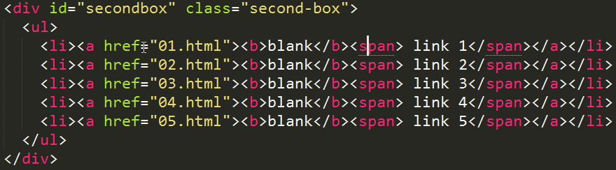

### 이전, 다음 편집점으로 이동

__Go to Edit Point - Ctrl+Alt+→ or Ctrl+Alt+←__

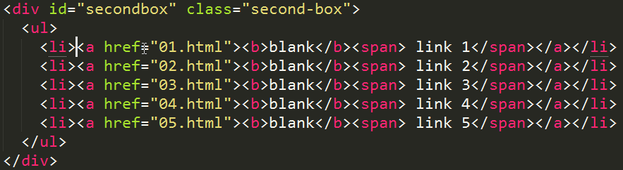

### 이전, 다음 아이템 선택

__Select Item - Shift+Ctrl+. or Shift+Ctrl+,__

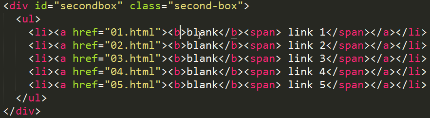

### 포인터가 위치한 곳이 포함하는 하위까지 주석처리

__Toggle Comment - Shift+Ctrl+/__

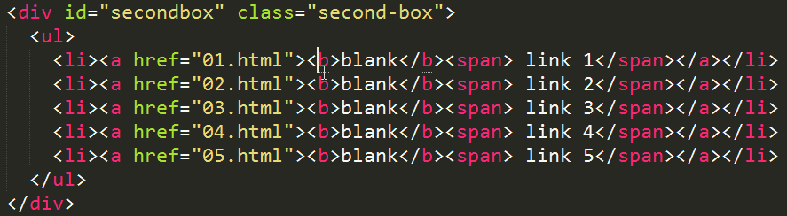

### 포인터가 위치한 곳의 시작태그와 끝맺음 태그를 삭제

__Remove Tag - Shift+Ctrl+;__

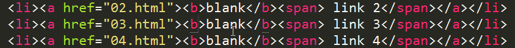

### 이미지 너비와 높이 자동 입력

__Update Image Size - Ctrl+U__

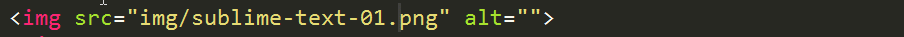

### 사칙연산 실행

__Evaluate Math Expression - Shift+Ctrl+Y__

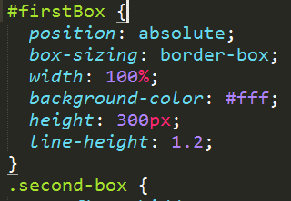

### Vendor Prefix CSS 변경 값을 반영

__Reflect CSS Value - Shift+Ctrl+Y__

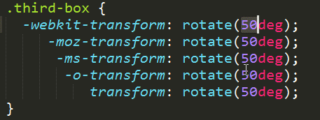

### 태그 이름 변경

__Rename Tag - Shift+Ctrl+'__

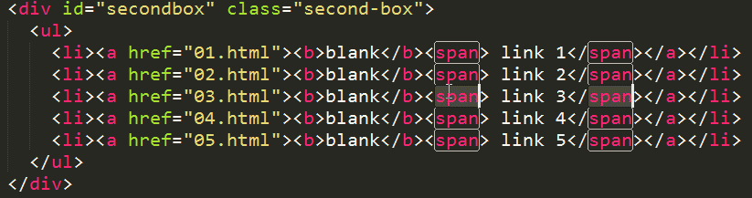

### Emmet 기능 키 정리
설명|단축키
---|---
Ctrl-+ E | Expand Abbreviation - 축약어 확장
Shift+Ctrl+G | Wrap With Abbreviation - 축약어로 감싸는 태그 생성
Ctrl + , | Match Tag Pair Outward - 쌍을 이루는 태그 안쪽을 선택
Shift+Ctrl+0 | Match Tag Pair Inward - 쌍을 이루는 태그 바깥쪽을 선택(윈도우에서 작동안함)
Ctrl+Alt+J | Go to Matching Pair - 쌍을 이루는 태그로 이동
Ctrl+Alt+→ or Ctrl+Alt+← | Go to Edit Point - 이전, 다음 편집점으로 이동
Shift+Ctrl+. or Shift+Ctrl+, | Select Item - 이전, 다음 아이템 선택
Shift+Ctrl+/ | Toggle Commend - 포인터가 위치한 곳이 포함하는 하위까지 주석처리
Shift+Ctrl+; | Remove Tag - 포인터가 위치한 곳의 시작태그와 끝맺음 태그를 삭제
Ctrl + U | Update Image Size - 이미지 너비와 높이 속성을 삽입
Shift+Ctrl+Y | Evaluate Math Expression - 사칙연산 실행
Shift+Ctrl+R | Reflect CSS Value - Vendor Prefix CSS 변경 값을 반영
Shift+Ctrl+' | Rename Tag - 태그 이름 변경

## 증가/감소 액션

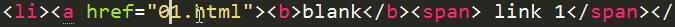

설명|단축키
---|---
Ctrl + ↑ | 1씩 증가
Ctrl + ↓ | 1씩 감소
Alt + ↑ | 0.1씩 증가
Alt + ↓ | 0.1씩 감소
Shift+Alt+↑ | 10씩 증가
Shift+Alt+↓ | 10씩 감소

## 사용자 키 바인딩

### Match Tag Pair Inword
쌍을 이루는 태그를 안쪽으로 선택하는 "Match Tag Pair Inword" 명령의 Ctrl+Shift+0 단축키가 실행이 되지 않는 오류가 있어 사용자 키 바인딩 설정으로, 이 명령이 실행 가능하도록 수정해 보겠습니다. 

서브라임 콘솔로 "Ctrl+," 단축키가 다른 명령으로 사용하고 있는지 확인한 후 사용하고 있지 않다면 "Preferences > Key Bindings - User" 메뉴를 실행해 " ".sublime-keymap" 파일을 열어 다음 코드를 입력합니다

```javascript
[{
  "keys": ["ctrl+."],
  "args": {
    "action": "balance_inward"
  },
  "command": "run_emmet_action",
  "context": [{
    "key": "emmet_action_enabled.balance_inward"
  }]
}]

```

 "Match Tag Pair Outword"의 단축키가 "Ctrl+,"로 지정되어 있어 "Match Tag Pair Inword"의 단축키도 직관적이게 "Ctrl+."으로 지정하였습니다.

### Line Up, Line Down
Emmet을 설치하면 기본 스크롤 기능인 Ctrl + ↑(up), Ctrl + ↓(down)이 Incerment/Decrement 명령으로 인해 실행이 되지 않습니다. 스크롤 기능을 사용하기 위해서 Ctrl+Up, Ctrl+Down 키를 사용자 키 바인딩에 재 설정해야합니다. Emmet의 증가, 감소 기능 사용하려면 별도의 키로 지정해 사용하시면 됩니다.

```javascript
[{
  "keys": ["ctrl+up"],
  "command": "scroll_lines",
  "args": { "amount": 1.0 }
}, {
  "keys": ["ctrl+down"],
  "command": "scroll_lines",
  "args": { "amount": -1.0 }
}]
```

### Goto Symbol in Project
Emmet을 설치하면 "Goto > "Goto Simbol in Project"의 단축키 Ctrl+Shift+R 키가 실행이 되지 않습니다. Emmet 기능 중 Reflect CSS Value 기능이 단축키를 재 정의해서 발생하는 현상입니다. "Goto Simbol in Project" 단축키를 사용하고 싶다면, 사용자 키 바인딩 파일에 해당 항목을 다시 작성하시면 됩니다.

```javascript
[{
  "keys": ["ctrl+shift+r"],
  "command": "goto_symbol_in_project"
}]
```

### Soft Undo
이미지 사이지 너비와 높이 조정하는 단축키 Ctrl+U가 선택해제 단축키를 덮어 씌우기 때문에 이미지 사이즈 조정 단축기능을 자주 사용하지 않는다면 기본 기능을 다시 설정해 사용하시기 바랍니다.

```javascript
[{
  "keys": ["ctrl+u"],
  "command": "soft_undo"
}]
```
