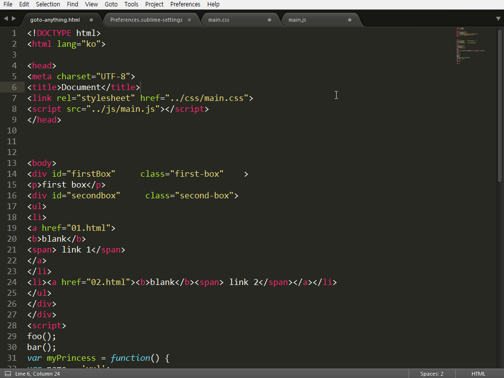

# HTML-CSS-JS Prettify

GIT: https://github.com/victorporof/Sublime-HTMLPrettify

코딩할 때 문서의 가독성을 높이기 위해 시간을 투자하는 것은 중요한 일입니다. 하나의 문서에 적게는 몇 십 줄의 코드가 들어가지만, 많게는 수 천 줄의 코드가 들어갈 수도 있기 때문입니다. 코딩 규칙 없이 상황에 따라 다른 규칙으로 코딩하게 되면, 다른 작업자의 코딩 스타일과의 문제가 발생할 수 있습니다.

프로젝트를 완료한 후, 수정이나 유지보수를 위해 문서를 확인해야 하는 상황이 발생하게 되면 수정할 부분을 찾는 것 자체가 큰 일이 될 수도 있습니다. 그렇게 멀리 생각하지 않고, 한 100줄 정도되는 코드를 작성하고 일 주일 후 그 문서를 열어 다시 확인한다 생각해 보세요. 코딩 규칙이나 주석이 규칙에 맞추어 작성되어 있지 않다면 이해하기 힘들 것입니다.

그렇기 때문에 코딩 규칙과 같은 문서를 만들고 항상 규칙에 맞춰 작업하는 좋은 습관을 가져야 합니다.
HTML-CSS-JS Prettify 플러그인은 이름에서 알 수 있듯이 HTML, CSS, JS 파일을 아름답게 만들어 주는 기능을 제공합니다. 기본 설정된 포맷에 맞춰 단 한 번의 키 조작으로 문서의 코딩 규칙을 적용해 줍니다. 물론 기본 설정값을 사용자가 다시 정의할 수도 있습니다.

HTML-CSS-JS Prettify 기능이 작동하려면 Node.js가 설치되어 있어야 합니다. Node.js 설치는 https://nodejs.org/en/#download 접속해 자신의 운영체제에 맞는 버전을 설치하시면 됩니다. 설치에 별다른 특별한 점이 없으므로 설치 방법은 설명하지 않겠습니다.

"Command Palette - Ctrl+Shift+P"를 실행해 "Package Control"를 열어 "install package"를 선택하고 " HTML-CSS-JS Prettify"를 입력해 설치를 진행합니다.

설치가 완료되면 "Preferences > Package Settings > HTML/CSS/JS Prettify" 항목이 추가된 것을 확인할 수 있습니다. HTML, CSS, JS파일 중 원하는 파일을 열고 Ctrl+Shift+H 키를 실행해 보세요.

모든 프로젝트, 모든 작업자가 동일한 코딩 규칙을 가지고 있는 것은 아니기 때문에, 플러그인이 기본적으로 제공하는 값을 수정해 사용할 수 있어야 합니다. 열려진 문서에서 오른쪽 마우스 버튼을 클릭해 " HTML/CSS/JS Prettify > Set Prettify Preferences" 항목을 선택하면 ".jsbeautifyrc"파일이 열리며 HTML, CSS, JS 파일의 설정값을 변경할 수 있습니다.
