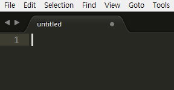
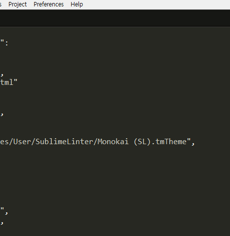
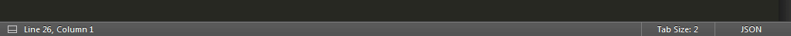
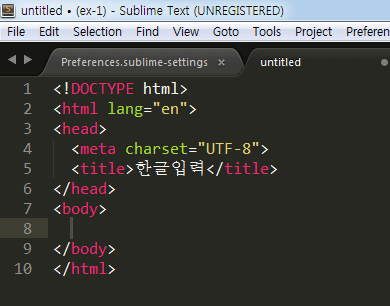

# IMESupport
서브라임 텍스트에서 한글을 입력할 때 초성, 중성, 종성의 입력하는 단어가 바로바로 에디터 본문에 출력되지 않고, 화면 상단에 입력도구가 출력된 후 한 글자가 완성되어 다음 글자로 넘어가는 순간 본문에 표시됩니다.

이 문제는 IMESupport라는 패키지를 설치해 한글 입력이 부자연스러운 현상을 보안해 보도록 하겠습니다.

## 설치
Command Palette를 열고 "Install Package"를 입력합니다. 키워드를 정확하게 입력하지 않고 "pcip"와 같이 단어의 머리글자만 입력해도 됩니다. "Package Control: Install Package"를 선택하면 서브라임 텍스트 하단의 상태 바에 진행 상태가 표시됩니다. 

진행 상태가 끝나면 Package Control Palette가 나타나며, " IME"를 입력하면 플러그인 목록이 검색 항목으로 정렬되며, 설치하려는 "IMESpport"를 선택해 설치를 진행합니다. 상태 표시줄에 설치 진행 상태가 나타납니다.

## 실행
설치가 완료된 후 한글을 다시 입력하면 한글을 타이핑하는 대로 편집 창에 출력이 되는 것을 확인할 수 있습니다. 

IMESupport 패키지 설치 후에도 다소 불편함이 없지는 않지만, 이 정도는 감수하고 사용할 만큼 충분히 매력적인 에디터일 것이라 말씀드리고 싶습니다.

### 그 밖의 유용한 패키지
패키지 | 설명
---|---
AdvancedNewFile | 빠른 파일 관리
CSScomb | 정의된 포맷에 맞추어 속성 자동 정렬
Emmet html, css | 자동완성 기능
HTML-CSS-JS Prettify |  HTML, CSS, JS, JSON 코드를 정의된 포맷에 맞추어 정리
SideBarEnhancements | 사이드 바에서 작업 및 폴더의 향상된 기능 제공
SublimeLinter | 코드 문법 검사를 위한 프레임워크
Autoprefixer |  css vendor prefix 자동입력

