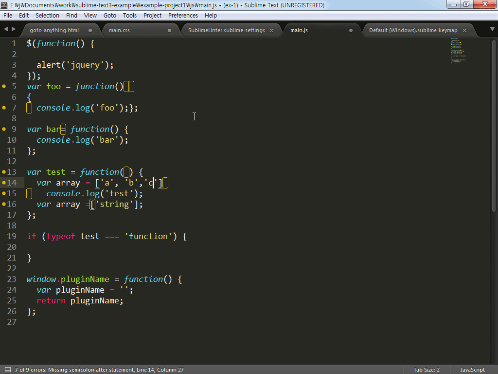
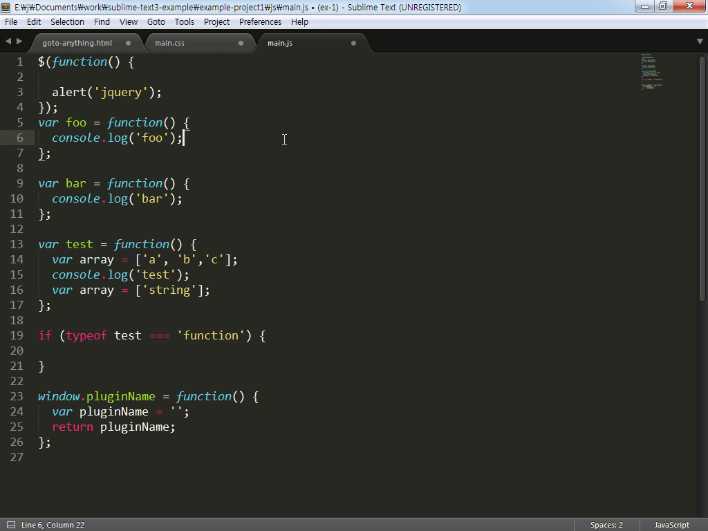

# SublimeLinter-jscs

자바스크립트의 문법은 엄격하지 않아  작업자의 스타일에 따라 작성하는 방법이 다를 수 있습니다. 만약 다른 작업자와 공동 작업을 진행해야 되는 상황에 코드의 작성 규칙이 있지 않다면, 코드는 작업자 마다 다른 규칙으로 작성해 가독성이 좋이 않을 것입니다. 코딩 규칙이 올바르지 않아 발생하는 문제 보다, 규칙을 지키지 않고 작성하는 것이 더욱 좋지 않은 습관인 것을 명심하세요. 올바르지 않은 규칙은 서로 협의를 통해 개선해 나아갈 수 있지만, 규칙을 지키지 않고 작업한 결과물의 수정은 많은 비용이 발생하게 됩니다.

sublimelinter-jscs 플러그인은 자바스크립트 코드 스타일을 제안하고 그 규칙에 대한 검사를 진행함으로써 다른 작업자들과 공동 작업을 진행할 때 정해진 코드 규칙을 통해 문서를 작성할 수 있습니다.



## jscs 설치

jscs를 실행하기 위해서는 [Node.js](https://nodejs.org/en/#download)가 설치되어야 있어야 합니다. [npm](https://www.npmjs.com/) 명령으로 csslint를 설치합니다.

```
npm install -g jscs
```

## 플러그인 설치

"Command Palette - Ctrl+Shift+P"를 실행해 "Package Control"를 열어 "install package"를 선택하고 "SublimeLinter-jscs"를 입력해 설치를 진행합니다.


## 기본 설정

"Preferences > Package Settings > SublimeLinter > Settings - User" 메뉴를 실행해 사용자 설정 파일을 열어 "jscs" 항목의 설정을 변경합니다.

```
"args": [
  "--config",
  "C:\\Sublime Text Build 3103 x64\\Data\\Packages\\User\\.jscsrc" // 규칙 파일 위치
]
```

사용자 설정파일에 .jscsrc 파일의 위치를 지정하면, 모든 프로젝트에 규칙이 적용됩니다. 프로젝트 별 규칙을 다르게 적용하려면 .jscsrc 파일을 프로젝트 루트에 생성하시면 됩니다.

jscs의 규칙은 http://jscs.info/rules에 자세하게 나와있으며, google, jquery 등의 팀에서 사용하는 파일을 적용해 사용할 수도 있습니다. 자세한 내용은 http://jscs.info/overview에서 확인해 보세요.



### 참고자료
* SublimeLinter-jscs: https://packagecontrol.io/packages/SublimeLinter-jscs
* jscs: http://jscs.info/overview
* Rules: http://jscs.info/rules
* node.js: https://nodejs.org/en/#download
* npm: https://www.npmjs.com/
* .jscsrc: https://github.com/jeonghakhur/sublime-text3/blob/master/.jscsrc


