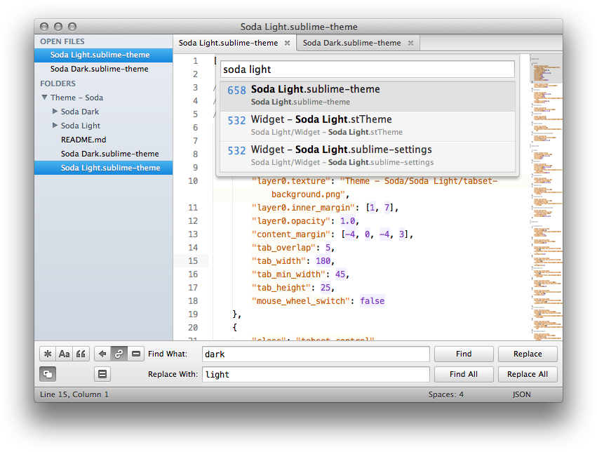
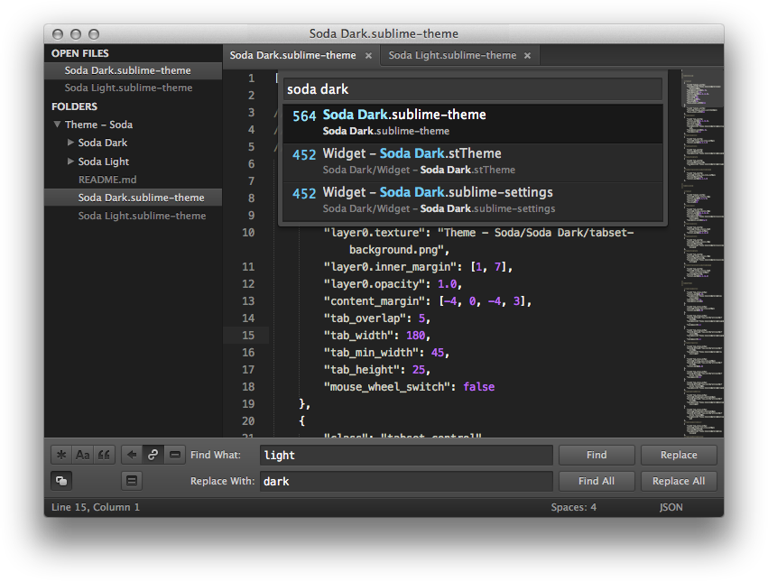
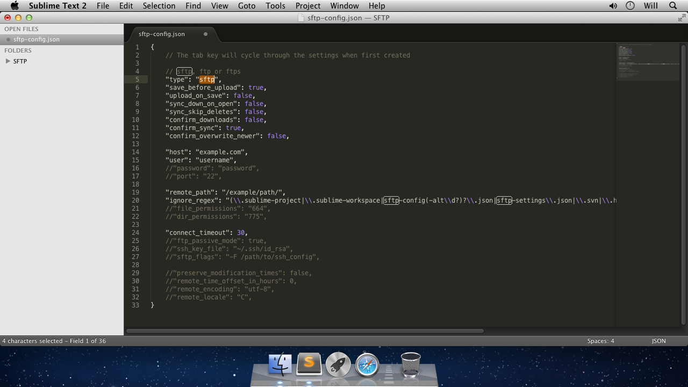
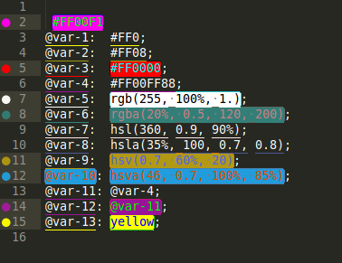
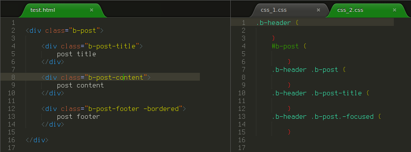

# 그 밖의 유용한 플러그인

## [Theme - Soda](http://buymeasoda.github.io/soda-theme/)

사용자 정의 UI 테마 입니다. light 버전과 dark 버전을 제공합니다.




#### 사용자 설정

"Preferences > Settings - User"

```javascript
{
  "theme": "Soda Dark 3.sublime-theme"
}
```

## [terminal](https://github.com/wbond/sublime_terminal)

현재 파일 위치에서 터미널을 오픈합니다.

#### 사용자 설정

"Preferences > Package Settings > Terminal > Settings - User"

```javascript
{
    "terminal": "C:\\Program Files\\Git\\git-bash.exe"
}
```

Shortcuts: ctrl+shift+t

## [SFTP](https://wbond.net/sublime_packages/sftp)



## [Color Highlighter](https://github.com/Monnoroch/ColorHighlighter)



## [BracketHighlighter](https://github.com/facelessuser/BracketHighlighter)


## [sublime-TortoiseSVN](https://github.com/dexbol/sublime-TortoiseSVN)


## [Goto-CSS-Declaration]()


