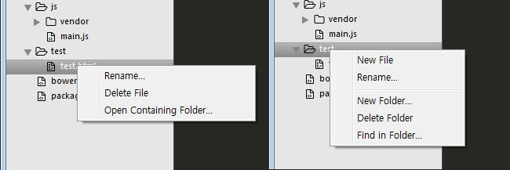
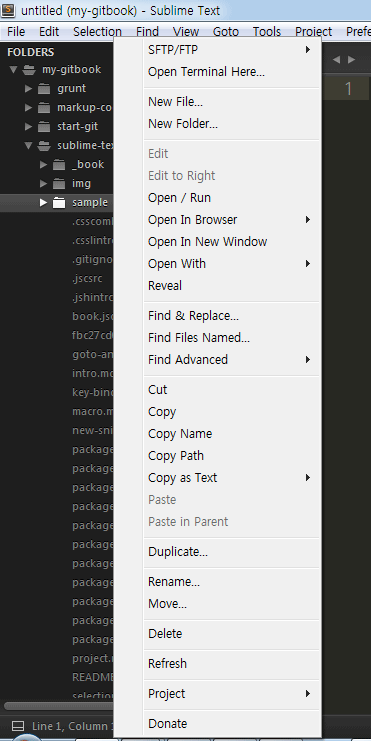
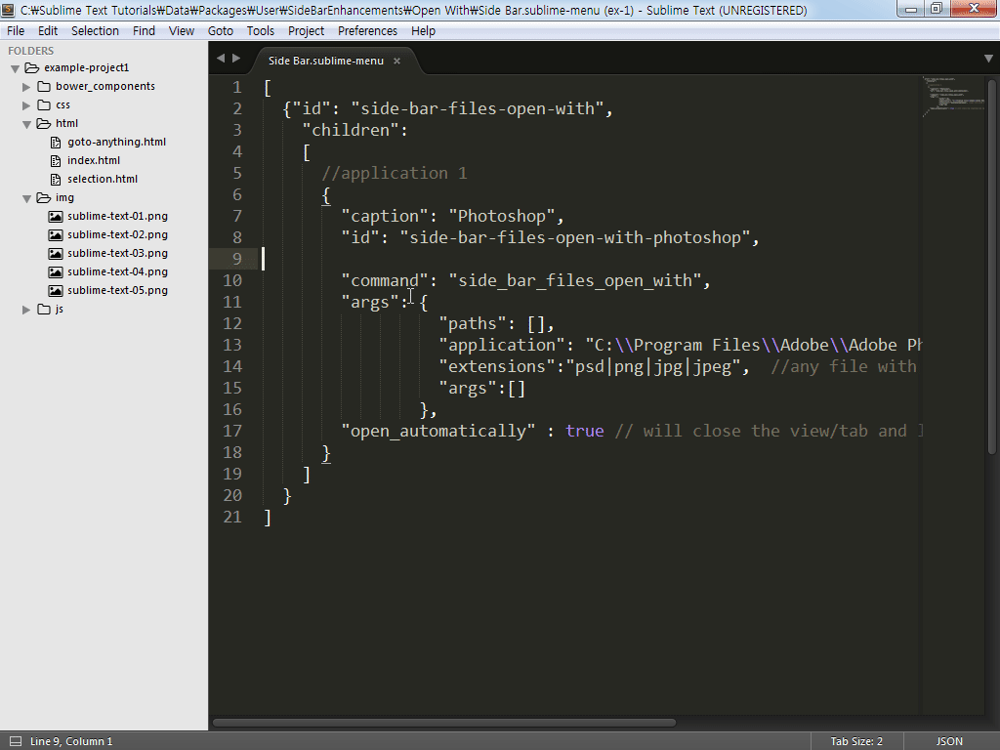

# SideBarEnhancements

Git: https://github.com/titoBouzout/SideBarEnhancements

서브라임 텍스트 사이드 바의 마우스 오른쪽 메뉴는 간단한 몇 가지 기능만 제공을 합니다. 폴더에서 마우스 오른쪽 버튼을 클릭하여 메뉴를 열면, 신규 파일 생성, 폴더 이름 변경, 신규 폴더 생성, 폴더 삭제, 폴더에서 찾기에 대한 기능 제공하고, 파일에서 오른쪽 마우스 버튼을 클릭하면 파일 이름 변경, 파일 삭제, 현재 파일 위치를 탐색기에서 열기 기능을 제공합니다.



## 설치
SideBarEnhancements 플러그인을 설치해 마우스 오른쪽 메뉴를 확장해 보겠습니다. Command Palette를 실행해(Ctrl+Shift+P) "install package"를 입력해 Package Control을 실행합니다. "SlideBarEnhancements"를 입력해 플러그인을 설치합니다. 설치가 완료되었다면 사이드 바의 파일이나 폴더에 마우스를 위치하고 오른쪽 버튼을 클릭해보세요. 전과 다르게 많은 항목이 추가되어 있는 것을 확인할 수 있습니다.



## 프로그램 등록
SideBarEnhancements 플러그인의 유용한 기능 중 Open With에 포토샵 프로그램을 등록해 이미지를 포토샵에서 바로 열어 볼 수 있게 설정해 보겠습니다. 폴더나 파일에 마우스를 포인터를 위치하고 오른쪽 마우스 버튼을 클릭해 메뉴를 열고 "Open With > Edit Applications"를 실행하면 Slide Bar.sublime-menu 파일이 열립니다. 기본적으로 몇 개의 프로그램이 등록되어 있으며 포토샵 프로그램도 등록되어 있는 것을 확인할 수 있습니다. "args"의 "application" 항목에 설치되어 있는 포토샵 프로그램의 경로를 입력해 주면 됩니다.

```javascript
[{
  "caption": "Photoshop",
  "id": "side-bar-files-open-with-photoshop",

  "command": "side_bar_files_open_with",
  "args": {
    "paths": [],
    "application": "C:\\Program Files\\Adobe\\Adobe Photoshop CS6 (64 Bit)\\Photoshop.exe", // OSX
    "extensions": "psd|png|jpg|jpeg|gif", //any file with these extensions
    "args": []
  },
  "open_automatically": false // will close the view/tab and launch the application
}]
```

이제 서브라임 텍스트에서 이미지 파일을 바로 편집기로 열어 볼 수 있습니다. 그 밖의 추가된 메뉴의 항목은 어려운 것이 없으므로 한 번씩 실행해 보시면 될 것 같습니다.



### 환경설정
서브라임 텍스트의 사이드 바에서 파일을 한 번 클릭하게 되면 편집 창에서 탭 하나가 추가되면서 파일 미리보기 기능을 제공합니다. 이 기능을 유용하게 사용할 수도 있지만 사이드 바에서 파일을 관리할 경우 약간 불편하기도 합니다. 사용자 환경 설정 "Preferences > Settings - User"에서 "preview_on_click"을 "false"로 설정하면 이 기능이 작동하지 않습니다.

```javascript
{
  "preview_on_click": false
}
```


