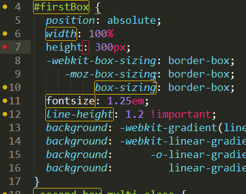

# SublimeLinter

코드의 오류가 있는지에 대한 검증은 정말 중요한 작업입니다. HTML의 경우 여는 태그는 있고 닫는 태그가 없으면 문서의 스타일이 깨지는 현상도 발생합니다. CSS의 경우는 코드의 오류로 인해 스타일이 무시되며, Javascript의 경우는 오류가 발생해 기능이 실행되지 않게 됩니다.

이런 오류를 검사하는 방법은 온라인 서비스를 이용해 확인하거나, 브라우저를 열고 일일이 디버깅하는 방법을 주로 사용합니다. 오류 검사를 해주는 통합개발 환경(IDE)를 지원하는 편집기를 사용할 수 있으나, 사용 방법이 까다롭고 사용자 설정 또한 불편합니다. 그리고 너무 무겁습니다. 또는 [Grunt](http://gruntjs.com/)나 [Gulp](http://gulpjs.com/)과 같은 자동빌드 도구를 이용하여 검사를 할 수 있으나 학습 비용이 적지 않게 발생하게 됩니다.

SublimeLinter 플러그인은 코드의 문법 오류를 찾아 주는 프레임워크입니다. 현재 작업하고 있는 코드의 오류가 있는지를 실시간으로 검사해 사용자에게 알려주는 아주 고급진 기능입니다. SublimeLinter 역시 [node.js](https://nodejs.org/en/#download)가 설치되어 있어야 하며, 검사를 하려는 파일 종류에 맞는 플러그인을 [npm(node package manager)](https://www.npmjs.com/)를 통해 설치되어야 합니다.

## 설치
"Command Palette - Ctrl+Shift+P"를 실행해 "Package Control"를 열어 "install package"를 선택하고 "SublimeLinter"를 입력해 설치를 진행합니다.

설치가 완료되면 "Preferences > Package Settings > SublimeLinter" 항목이 추가된 것을 확인할 수 있습니다.

SublimeLinter의 오류 검사는 기본 값이 백그라운드로 되어 있어 코드를 작성하는 실시간으로 코드 검사를 진행합니다. 실시간으로 검사하는 기능이 필요하지 않고, 사용자 명령을 통해 검사를 진행하는 방법으로 파일의 오른쪽 메뉴를 클릭하고 "SublimeLinter > Lint Mode > Manual"로 설정하고 "Lint This View"를 실행하면 검사가 진행됩니다. 단축키는 Ctrl+K, L 입니다.

Front-end 개발에 주로 사용되는 문법 오류 검사 플러그인은 다음과 같습니다.
* [SublimeLinter-csslint](https://github.com/SublimeLinter/SublimeLinter-csslint)
* [SublimeLinter-jscs](https://packagecontrol.io/packages/SublimeLinter-jscs)
* [SublimeLinter-jsHint](https://github.com/SublimeLinter/SublimeLinter-jshint)
* [SublimeLinter-json](https://github.com/SublimeLinter/SublimeLinter-json)
* [SublimeLinter-contrib-htmllint](https://github.com/necramirez/SublimeLinter-contrib-htmllint)

### 참고자료
* SublimeLinter: http://sublimelinter.readthedocs.org
* node.js: https://nodejs.org/en/#download
* npm: https://www.npmjs.com/
