# 다중선택 및 편집

서브라임 텍스트의 편집 기능은 아주 강력합니다. 그 중에서 여러 단어를 쉽게 선택하거나 특정 영역을 다중으로 선택해서 일괄적인 수정을 할 수 있는 기능을 제공합니다.

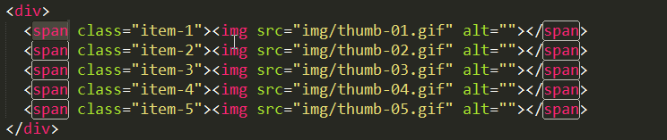

## 단어 선택

편집 창에서 코드를 선택하는 방법은 마우스를 사용해 선택하고자 하는 영역을 드래그하거나, 선택하려는 단어를 더블 클릭해서 선택할 수 있습니다. 또한 Shift 키와 Shift + Ctrl 키를 누른 상태에서 방향키를 이용하여 단어 및 줄을 선택할 수도 있습니다. 이러한 방법은 여러 편집기에서 제공하고 있는 보편적인 선택 방법입니다.

조금 더 편리하게 코드를 선택하는 방법은 단축키를 활용하는 것입니다. 서브라임 텍스트에서는 Ctrl+D 키를 사용해 단어를 선택할 수 있습니다. 선택한 단어와 동일한 단어를 더 선택하려면 다시 Ctrl+D를 누르면 됩니다. 현재 선택된 단어를 건너뛰고 다음 단어를 선택하려면 Ctrl+K를 누르면 됩니다. 선택된 단어를 역순으로 하나씩 해제하려면 Ctrl+U, 선택된 모든 것을 해제하려면 ESC 키를 입력하면 됩니다. 또는 Alt+F3 입력하면 열려있는 페이지에서 모든 동일한 단어가 선택됩니다. 이렇게 선택되는 상태를 다중 선택이라 말하며 다중 선택된 상태에서 코드를 입력하게 되면 선택된 모든 부분에 동시적으로 코드 입력이 가능하게 됩니다.

##### 단어 선택
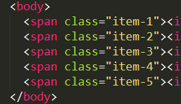

##### 단어 선택 건너뛰기
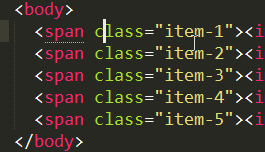

##### 단어 선택 해제 - 되돌리기
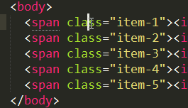

##### 단어 선택 전체 해제
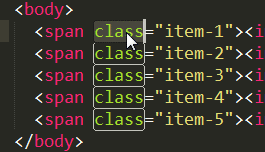

### 단어 편집 단축키
설명|단축키
---|---
커서가 위치한 단어를 선택하고, 동일한 단어를 순차적으로 연속해서 선택 |Ctrl+D
선택된 단어를 선택해제 |Ctrl+K
선택된 단어와 같은 단어를 문서에서 모두 선택 |Alt+F3
선택된 단어를 역순으로 선택해제 | Ctrl+U
단어 선택 모드를 해제 | ESC


## 줄 선택

코드를 편집하다 보면 특정 부분에 일괄 적으로 수정이 필요할 경우가 있습니다. 
예를 들어 여러 줄이 있는 리스트의 자식 Img 태그에 A 태그를 부모로 새로 만들어야 하는 수정이 발생하였다면 상당히 많은 키보드 조작과 마우스 조작을 통해 수정을 진행하였을 것입니다. 서브라임 텍스트는 이러한 수정을 간단하게 해결할 수 있는 방법을 제공합니다.

현재 커서가 있는 위치에서 Ctrl+L 키를 눌러 줄을 선택할 수 있습니다. 다시 Ctrl+L 키를 누르면 다음 줄이 선택됩니다. 편집하고자 하는 여러 줄을 선택하였다면 Ctrl+Shift+L 키를 눌러 편집 가능한 상태로 전환합니다. 방향키로 img 태그의 닫는 태그 위치로 커서를 이동합니다. 이동되었다면 Shift+Ctrl+방향키를 사용하여 img 태그를 선택합니다. Shift+Alt+W를 키를 누르면 선택된 태그를 감싸는 태그를 입력할 수 있습니다.

줄 선택은 Ctrl+Alt+Up, Ctrl+Alt+Down 키를 통해서도 가능하며, 현재 Scope 안에 있는 전체 줄을 선택하는 Ctrl+Shift+J 키를 이용해 보다 편리하게 작업을 할 수 있습니다

##### 줄 편집 방법 - Ctrl+L, Ctrl+Shift+L 이용
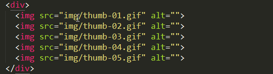

##### 줄 편집 방법 - Ctrl+Alt+Down 이용
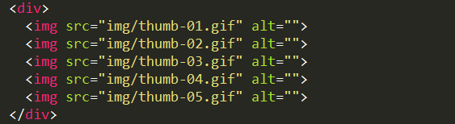

##### 줄 편집 방법 - Ctrl+Shift+J 이용
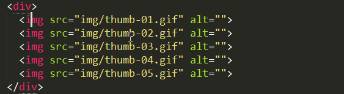

### 줄 편집 단축키

설명|단축키
---|---
행 선택  | Ctrl+L
행이 선퇙된 상태에서 각각 한 줄씩 편집 가능 | Ctrl+Shift+L
행의 특정 위치를 편집 | Ctrl+Alt+(up, down)
Bracket 범위 안의 내용 선택 | Ctrl+Shift+M
같은 레벨안의 들여쓰기가 동일한 내용 선택 | Ctrl+Shift+J

## 마우스로 선택
단어 선택과 줄 선택은 코드의 일부분이 동일한 패턴을 가지고 있어야 가능합니다. 어떤 경우는 불규칙 적으로 코드의 일 부분을 선택해서 편집해야 되는 상황이 있습니다. 이 경우는 마우스와 키보드 조작으로 불규칙 적인 문서의 특정 부분을 다중 선택할 수 있습니다.
Ctrl+ 마우스 좌측 버튼을 클릭해서 문서의 편집할 곳을 선택합니다.

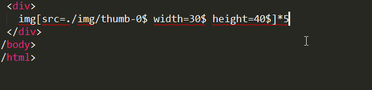

## 그 밖의 선택 유용한 편집 기능
편집을 하다 보면 가장 많은 작업은 Copy & Paste입니다. 코드의 한 줄을 복사하거나 여러 줄을 복사해 붙여 넣는 것은 가장 기본적인 코딩 작업일 것입니다. 보통 코드를 복사하기 위해서는 마우스를 사용하거나 Ctrl, Shift, 방향키를 이용해 영역을 선택해 복사 잡업을 진행합니다 . 이제는 그러한 방법을 사용하지 말고 손의 피로를 줄여 주세요.

### 줄 복사

Ctrl+Shift+D 키는 줄을 복사합니다. 여러 줄을 복사하고 싶다면 Ctrl+L 키로 여러 줄을 선택한 다음 Ctrl+Shift+D 키를 누르면 됩니다.

Scope 안의 내용을 한 번에 선택을 하려면 Ctrl+Shif+J 키를, 선택된 범위에서 상위 영역을 선택하려면 Ctrl+Shift+A 키를 누르면 됩니다. 

코드에 Bracket이 사용되는 CSS, Javascript는 Ctrl+Shift+M 키를 사용하여 Bracket 영역의 내용을 선택하게 됩니다.

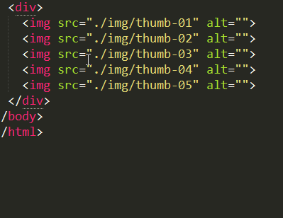

### 줄 삭제
코드를 삭제하는 방법은 문서의 내용 중 삭제하려는 부분을 선택해서 Backspace 키나 Delete 키를 이용해 삭제를 합니다. 이렇게 삭제하게 되면 삭제한 부분에 빈 줄이 남아 있어 라인을 삭제하기 위해서는 또 한 번의 동작이 필요합니다. 서브라임 텍스트의 단축키를 이용해 삭제하게 되면 이러한 불필요한 작업을 반복하지 않아도 됩니다. 커서가 있는 현재 라인을 삭제하고 싶다면 Ctrl+Shift+K를 누르면 됩니다. 여러 줄 삭제도 선택 후 단축키를 누르면 됩니다. 현재 커서 위치에서 줄 끝까지 삭제하려면 Ctrl+K+K, 맨 줄 처음까지 삭제하려면 Ctrl+Shift+Backspace 키를 사용합니다.

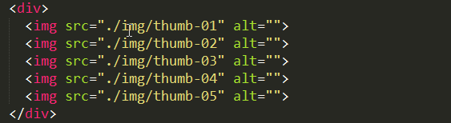

### 들여쓰기
선택된 내용을 들여쓰기 하기 위해서는 Ctrl+](Right Bracket) 키, 내여 쓰기는 Ctrl+[(Left Bracket) 를 사용합니다.
선택된 내용이 문서의 들여쓰기 기준과 맞지 않게 들여 쓰기가 되어있다면 메뉴의 “Edit > Line > Reindent” 를 이용해 문서의 들여쓰기 포맷에 맞춰 자동 들여 쓰기를 수정할 수 있습니다. 메뉴를 통해 편집하는 것을 권장하지는 않지만 단축키가 제공되지 않으므로 어쩔 수 없네요. 단축키가 없는 메뉴에 대해서 단축키를 지정하는 방법은 별도로 “Key Bindings” 에서 설명해 드리도록 하겠습니다.

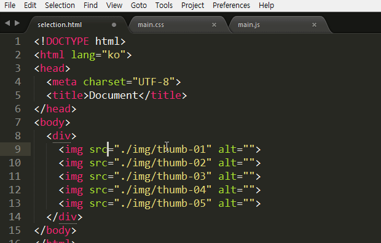

### 라인 추가
코드를 작성하다 보면 줄을 바꿔서 코드를 새로 작성해야 하는 상황이 발생합니다. 이런 작업은 CSS 편집과 Javascript를 작성하다 보면 빈번하게 발생하게 되는데, 현재 편집 중인 라인 위, 아래에 새로운 라인을 생성하려면 커서를 현재 편집 중이 맨 앞이나 뒤로 이동해 Enter 눌러 신규 라인을 만들곤 합니다. 서브라임 텍스트는 단 한 번의 동작 만으로 이러한 기능을 해결합니다.
위로 새로운 라인을 추가하려면 Ctrl+Shift+Ener, 아래로 새로운 라인을 추가하려면 Ctrl +Enter 키를 누르면 됩니다. 

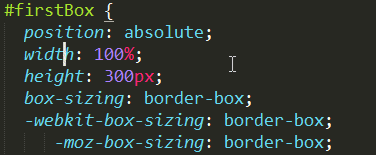

### 줄 이동
현재 커서가 있는 라인의 줄의 위치를 변경하려면 Ctrl+Shift+Up, Down 키를 사용하며, 여러 줄의 이동은 여러 줄을 선택한 상태에서 줄 이동 단축키를 사용하면 됩니다.

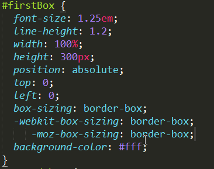

### 주요 편집 단축키
설명|단축키
---|---
줄 복사 | Ctrl+Shift+D
줄 삭제 | Ctrl+Shift+K
커서부터 줄 끝까지 삭제 | Ctrl+K, Ctrl+K
커서부터 줄 처음까지 삭제 | Ctrl+Shift+Backspace
들여쓰기 | Ctrl+](Right Bracket)
내여쓰기 | Ctrl+[(Left Bracket)
이전 줄 추가 | Ctrl+Shift+Ener
다음 줄 추가 | Ctrl +Enter
줄 이동 | Ctrl+Shift+Up, Down


### 단어 분리 - 사용자 설정
단어를 선택하다 보면 단어를 구분 짓는 문자에 때문에 한 번에 선택되지 않는 상황이 있을 것입니다.  예를 들어 단어를 구분하기 위하여 점, 하이픈, 언더라인 등의 특수 문자를 조합한 단어들일 것입니다. 이 때문에 한 번의 키보드 조작이나 마우스 조작으로 선택이 되지 않아 반복적인 작업을 수행합니다.

서브라임의 텍스트는 하이픈이 들어간 단어를 한 번에 선택할 수 없습니다. 최근 인기 있는 라이브러리나 프레임워크를 확인해보면 단어를 구분하는 문자로 하이픈을 많이 사용하고 있습니다. 저 역시 CSS 클래스 이름을 정할 때 언더라인 보다 하이픈 사용하고, 다른 작업자들에게도 하이픈 사용을 권장하고 있습니다. 하이픈 사용을 권장하는 이유는 CSS 클래스 Name과 함수, 메서드, HTML 아이디의 Name을 명확하게 구분하고, 가독성을 높이는데 있지만, Shift 키의 압박에서 벗어나 손의 피로를 덜어 줄여는 이유도 있습니다.

그럼 어떻게 하이픈이 포함된 단어를 한 번에 선택할 수 있는지에 대해서 알아보겠습니다. 메뉴의 “Preferences > Settings Default”를 선택하여 기본 설정 파일을 열어 보겠습니다. 작성된 문서의 형식은 Json 포맷입니다. 파일의 내용 중 “word_separators”라는 키 값을 찾아 보면, 특수문자들로 된 값을 확인할 수 있습니다. 다시 “Preferences > Settings User”를 선택해 사용자 설정 파일을 열어 보겠습니다. 처음에 아무것도 없는 빈 내용의 파일이 열리게 됩니다. Json 포맷 형식으로 작성하기 위해 bracket 입력하고, 기본 설정 파일의 “word_separators” 내용을 복사해 사용자 설정 파일에 붙여 넣기 합니다. 기본 정의된 단어의 값 부분에서 하이픈을 제거하고 파일을 저장합니다.

```javascript
{
  "word_separators": "./\\()\"':,.;<>~!@$%^&*|+=[]{}`~?"
}
```

##### 사용자 설정 전
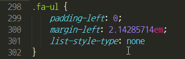

###### 사용자 설정 후
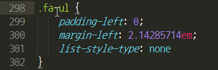
