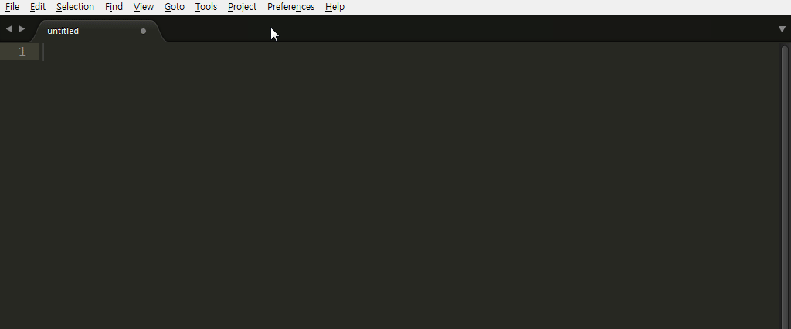

# Snippets
서브라임 텍스트는 코드를 빠르게 작업할 수 있는 유용한 방법을 제공합니다. 미리 정의된 키워드를 입력하고 자동완성 목록에서 해당 Snippets을 선택하면 미리 정의된 코드가 편집 창에 출력됩니다.



```javascript
function function_name(argument) {
  // body...
}
```

입력된 코드를 보면 'function_name'이 선택된 상태로 텍스트를 입력하면, 바로 함수 이름을 수정할 수 있습니다. 함수의 이름을 입력한 후 탭 키를 누르면 인수를 편집할 수 있으며 인수를 편집하고 탭 키를 누르면 Bracket 안으로 포커스가 이동합니다.

이와 같이 코드를 입력하는 일련의 작업을 최소한의 키보드 동작으로 가능하게 되는 유용한 기능입니다. 사용 가능한 Snippets의 목록은 메뉴의 "Tools > Snippets"에서 확인할 수 있습니다.
